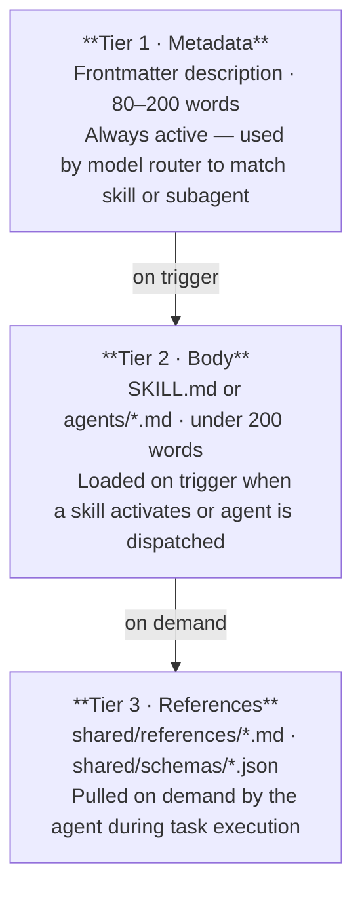
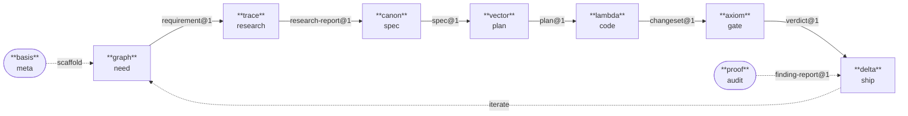
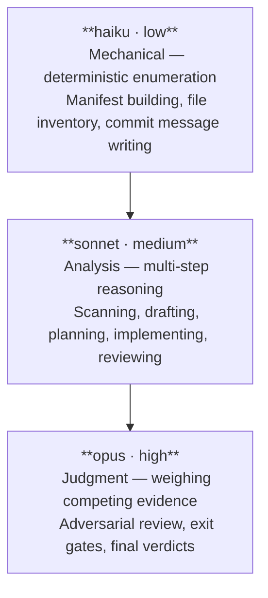
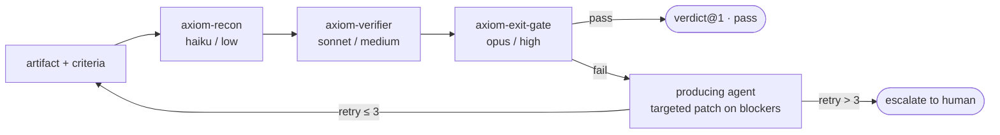

# Architecture

How plugins are structured, how agents communicate, how context is managed, and how the verification gate works.

---

## 1. Progressive Disclosure

Context is loaded on demand. Every agent's context window contains only what its current task requires.



Agents pull reference files themselves using their file reading tool. The host never pre-loads them.

---

## 2. Plugin Structure

```
plugins/<id>/
├── plugin.json              ← Manifest: id, version, skills, agents list
├── README.md                ← Plugin documentation
├── CHANGELOG.md             ← Version history
├── skills/<id>/SKILL.md     ← Skill prompt (what the user invokes)
└── agents/*.md              ← Individual agent prompts
```

`plugin.json` fields: `id`, `version` (semver), `description`, `skills` (path to skills dir), `agents` (list of agent file paths).

---

## 3. The Lifecycle Pipeline

Nine plugins form a directed pipeline. Each stage produces a typed artifact consumed by the next.



**Composable:** any contiguous subset installs cleanly. Start at `canon` if requirements come from an external tracker. End at `axiom` if automated release notes aren't needed.

**Substitutable:** any stage can be replaced by a different implementation that honours the same schema contract. A Jira plugin replacing `graph` just needs to emit `requirement@1`.

---

## 4. Shared Schema Contract

Schemas in `shared/schemas/` are the inter-agent API surface. Rules:

- **Format:** JSON Schema draft-2020-12
- **Strict:** `additionalProperties: false` on all schemas — unknown fields are rejected at validation time
- **Scratchpad:** every schema includes `reasoning: string`, an unconstrained chain-of-thought field that is never forwarded downstream
- **Immutable versions:** `requirement@1.json` never changes; breaking changes produce `requirement@2.json`
- **Validation timing:** wiring time, before agent execution — not at runtime inside the agent

---

## 5. Model and Effort Tiering

Each subagent declares `model` and `effort` in its frontmatter. These are routing hints. Claude Code honours them directly; AGY applies its own model routing and ignores them.



Use the lowest tier that produces correct output. Opus is reserved for decisions that produce a binding verdict with downstream consequences.

---

## 6. The Axiom Gate Protocol

`axiom` is a reusable, artifact-agnostic verification gate. Any artifact type — spec, plan, changeset, finding report — can be run through it.



On `fail`, the orchestrator passes **only the blockers array** back to the producing agent — not the full artifact context — so it can make a targeted fix. On retry 2, the effort level escalates. After 3 retries, the circuit breaks and control passes to the human.

`retry_count` is tracked inside `verdict@1` and incremented by the exit gate on each pass.

---

## 7. Agent Authoring Principles

Full guide: `shared/agent-best-practices.md`. Key constraints:

**4-part agent structure** — every agent defines:

| Part | Purpose |
| :--- | :--- |
| **Backstory** | 2–4 sentences of experiential perspective. What has this agent been burned by? What does it value? Guides judgment in the open interior. |
| **Goal** | What the agent must produce and why. Intent, not steps. |
| **Judgment** | How to know if the goal was genuinely achieved vs. output that looks like it was. Names the key failure mode. |
| **Output** | Structured output shape, referencing a schema from `shared/schemas/` when the output flows to another agent. |

**Cognitive mode dispatch** — agents are dispatched by the cognitive mode they require, not by taxonomy number. A plugin with distinct scanning, tracing, adversarial, systemic, behavioral testing, and repair phases should have a dedicated agent per mode.

**Progressive context loading** — each agent declares a `<load_first>` block naming the specific `shared/references/` file for its phase. Never load all reference files into all agents.

**EARS for edges only** — EARS notation (`WHEN`, `IF`, `WHILE`, `WHERE`) belongs in output contracts and never-do rules. Not in implementation steps or search strategies — those are the interior where agent judgment is the point.

**Schema-driven handoffs** — where one agent's output is another's input, both reference the same schema file from `shared/schemas/`. The schema is the contract; the prompt describes the intent.

---

## 8. Cross-Platform Compatibility

Plugins run natively in Claude Code and AGY — no custom server framework required.

| Concern | Approach |
| :--- | :--- |
| Model routing | `model`/`effort` frontmatter for Claude Code; AGY uses its own router |
| Tool calls | Abstract language — portable across both platforms |
| Paths | Relative only — `shared` symlink provides consistent paths from any plugin dir |
| Schema validation | Wiring-time, host-side — agents never validate JSON Schema directly |
