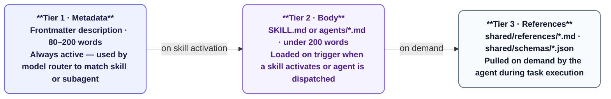
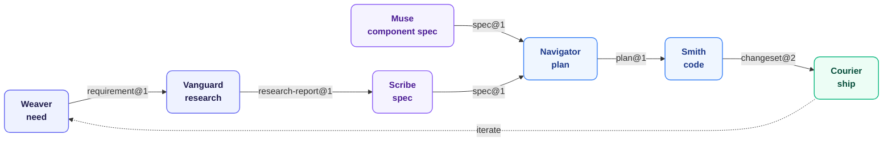
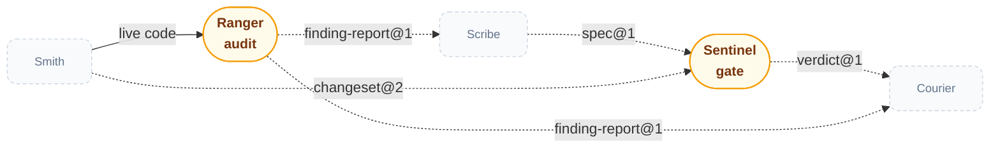
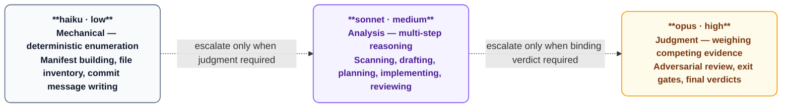
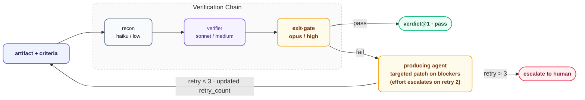
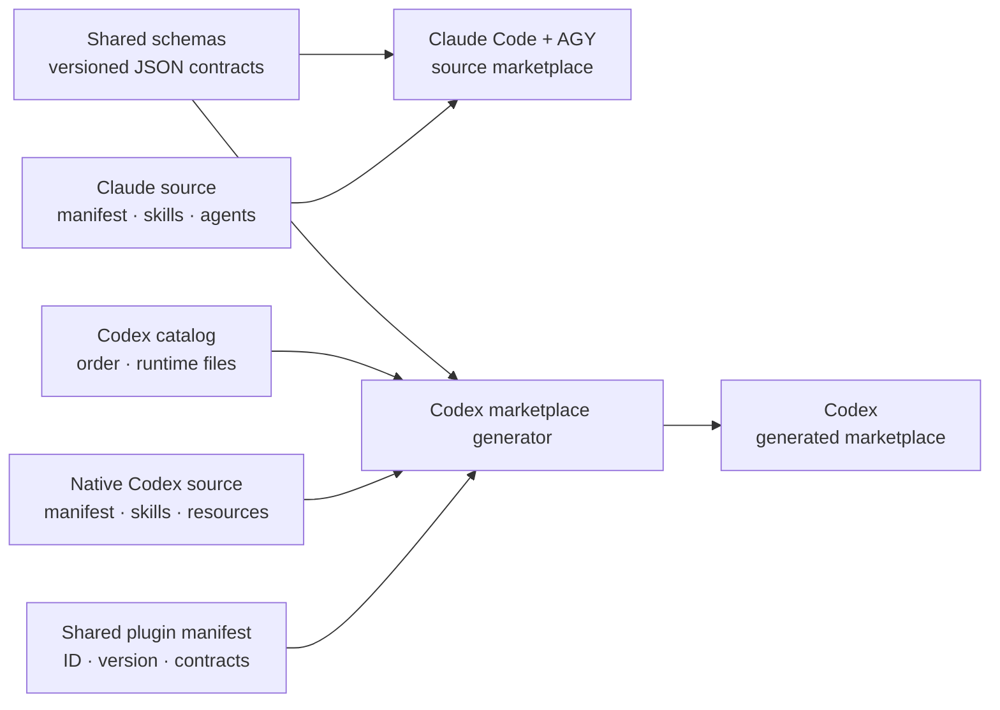
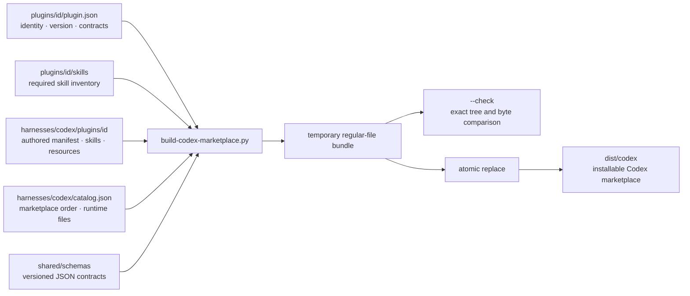

# Architecture

System design for plugin authoring, lifecycle contracts, generated Codex distribution, validation, and release safety.

---

## 1. Progressive Disclosure

Context is loaded on demand. Every agent's context window contains only what its current task requires.



Agents pull reference files themselves using their file reading tool. The host never pre-loads them.

---

## 2. Plugin Structure

```
plugins/<id>/
├── plugin.json              ← Manifest: id, version, skills, agents list
├── README.md                ← Plugin documentation
├── CHANGELOG.md             ← Version history
├── skills/<id>/SKILL.md     ← Skill prompt (what the user invokes)
└── agents/*.md              ← Individual agent prompts
```

`plugin.json` fields: `id`, `version` (semver), `description`, `skills` (path to skills dir), `agents` (list of agent file paths).

A plugin defaults to one skill directory named after the plugin id. IF the plugin's scope covers several genuinely independent, heterogeneous intents on the same artifact — not a linear pipeline invoked as one flow — `skills/<id>/` may split into `skills/<skill-name>/SKILL.md` per skill instead; `courier`, `scribe`, `weaver`, and `mason` all do. The routing key is the directory name, not the frontmatter `name:` field. See `shared/constitution.md`'s Plugin Structure and Skill Names sections.

---

## 3. The Lifecycle Pipeline

Ten plugins form a directed pipeline. Each stage produces a typed artifact consumed by the next.

**The primary flow** — one direction, no side-taps:



**Verification** — Sentinel and Ranger attach to the flow above but aren't stops in its sequence; the muted dashed boxes below are the same personas shown only as attachment points:



    

*Pill-shaped nodes are cross-cutting checkpoints, not sequence stops. Solid arrows are direct handoffs; dashed arrows are verification side-channels. Ranger's input is the live codebase Smith just wrote, not a schema handoff — the one solid arrow in the second diagram.*

**Composable:** any contiguous subset installs cleanly. Start at `scribe` if requirements come from an external tracker. End at `smith` if automated shipping tooling isn't needed. Layer `sentinel` in at any stage for an independent verification pass.

**Substitutable:** any stage can be replaced by a different implementation that honours the same schema contract. A Jira plugin replacing `weaver` just needs to emit `requirement@1`.

**Cross-cutting, not inline:** `sentinel`'s `plugin.json` declares `consumes: []` — nothing invokes it automatically. `exit-gate` and `exit-gate` are separate, dedicated agents that independently implement the same recon → verify → judge discipline sentinel formalizes; they do not call into sentinel's own agents. Install sentinel when you want that protocol available standalone against any artifact, including as a second opinion on top of scribe's or smith's own gate.

---

## 4. Shared Schema Contract

Schemas in `shared/schemas/` are the inter-agent API surface. Rules:

- **Format:** JSON Schema draft-2020-12
- **Strict:** `additionalProperties: false` on all schemas — unknown fields are rejected at validation time
- **Scratchpad:** every schema includes `reasoning: string`, an unconstrained chain-of-thought field that is never forwarded downstream
- **Immutable versions:** `requirement@1.json` never changes; breaking changes produce `requirement@2.json`
- **Validation timing:** wiring time, before agent execution — not at runtime inside the agent

---

## 5. Model and Effort Tiering

Each subagent declares `model` and `effort` in its frontmatter. These are routing hints. Claude Code honours them directly; AGY applies its own model routing and ignores them.



Use the lowest tier that produces correct output. Opus is reserved for decisions that produce a binding verdict with downstream consequences.

---

## 6. The Sentinel Gate Protocol

`sentinel` is a reusable, artifact-agnostic verification gate. Any artifact type — spec, plan, changeset, finding report — can be run through it.



On `fail`, the orchestrator passes **only the blockers array** back to the producing agent — not the full artifact context — so it can make a targeted fix. On retry 2, the effort level escalates. After 3 retries, the circuit breaks and control passes to the human.

`retry_count` is tracked inside `verdict@1` and incremented by the exit gate on each pass.

---

## 7. Agent Authoring Principles

Full guide: `shared/agent-best-practices.md`. Key constraints:

**5-part agent structure** — every agent defines:

| Part | Purpose |
| :--- | :--- |
| **Constitution** | Ecosystem-wide invariants, byte-identical across every agent — the shared cache prefix. Never authored per-agent; copied verbatim. |
| **Backstory** | 2–4 sentences of experiential perspective. What has this agent been burned by? What does it value? Guides judgment in the open interior. |
| **Goal** | What the agent must produce and why. Intent, not steps. |
| **Judgment** | How to know if the goal was genuinely achieved vs. output that looks like it was. Names the key failure mode. |
| **Output** | Structured output shape, referencing a schema from `shared/schemas/` when the output flows to another agent. |

**Cognitive mode dispatch** — agents are dispatched by the cognitive mode they require, not their pipeline position.
- A scanner (exhaustive pattern matching, no filtering) and an adversary (default-to-skepticism, requires a concrete failing scenario) cannot share a mental mode — combining them produces an agent worse at both
- Modes: enumeration (haiku/low), tracing/analysis/repair (sonnet/medium), adversarial judgment (opus/high)
- A plugin with distinct scanning, tracing, adversarial, and repair phases has a dedicated agent per mode

**Progressive context loading** — each agent loads only the reference file for its cognitive phase.
- A `<load_first>` block names the specific `shared/references/` file — scanner loads hazards, architect loads smells, mutator loads tooling
- Never load all reference files into all agents — attention degrades when the context window contains material the agent won't use

**EARS for edges only** — EARS notation (`WHEN`, `IF`, `WHILE`, `WHERE`) belongs in output contracts and never-do rules.
- Not in implementation steps or search strategies — those are the interior where agent judgment is the point
- Over-constraining the interior caps the agent at the level of the author's imagination

**Schema-driven handoffs** — where one agent's output is another's input, both reference the same schema file from `shared/schemas/`. The schema is the contract; the prompt describes the intent.

---

## 8. Cross-Harness Distribution

The repository has one lifecycle contract and harness-specific execution packages. Claude Code and AGY consume the authored plugins directly; Codex consumes a generated, materialized marketplace. No custom server framework is required.



| Concern | Claude Code and AGY | Codex |
| :--- | :--- | :--- |
| Plugin metadata | `plugins/<id>/plugin.json` | Native `.codex-plugin/plugin.json`, version- and author-checked against the shared manifest |
| Workflow implementation | Authored skills and specialist agents | Separately authored skills in `harnesses/codex/plugins/<id>/skills/` |
| Delegation | Named agents where the host supports them | Optional agent teams using packaged cognitive-mode role cards; complete single-agent fallback |
| Durable handoffs | Versioned JSON schemas in `shared/schemas/` | Identical bytes materialized only where the native workflow needs them |
| Runtime paths | Relative paths; source symlinks may provide shared context | Regular files only; generated output contains no symlinks |
| Marketplace root | Repository root marketplace files | `dist/codex/.agents/plugins/marketplace.json` |

`plugins/<id>/plugin.json` remains authoritative for shared ID, version, author, and produced/consumed artifacts. `harnesses/codex/plugins/<id>/` owns the Codex manifest, skills, category, capability, resource, and team-use choices. `harnesses/codex/catalog.json` owns marketplace order and runtime-file materialization. `tools/build-codex-marketplace.py` atomically packages `dist/codex`; generated files are reviewed and released with their sources, never edited by hand.

The schema is the cross-harness contract. Named agents, model routing, prompt wording, tool availability, and delegation strategy are harness-specific implementation details.

- A source change is shared only when it affects plugin identity or a versioned artifact contract.
- A workflow change is compatible only when both harnesses preserve the intended schema, evidence, and acceptance criteria; transcript or prose identity is not required.
- Codex may use an agent team for independent work, but a missing team capability never blocks the single-agent workflow.

---

## 9. Codex Marketplace Build System

`dist/codex` is a reproducible build artifact, not a second authored plugin tree. The generator packages native Codex sources without rewriting them, while rejecting ID, version, author, and skill-set drift from the shared plugin contract.



| Input | Authoritative for | Generator behavior |
| :--- | :--- | :--- |
| `plugins/<id>/plugin.json` | Shared plugin ID, version, author, `consumes`, and `produces` | Verifies the catalog ID plus native version and author match the shared source |
| `plugins/<id>/skills/*/SKILL.md` | Required skill-name inventory | Requires exact native Codex skill-name parity; does not copy or transform Claude prompt bodies |
| `harnesses/codex/plugins/<id>/` | Native Codex manifest, workflows, resources, and team policy | Copies authored regular-file content byte-for-byte into the bundle |
| `harnesses/codex/catalog.json` | Marketplace identity, plugin order, and runtime dependencies | Rejects unknown or duplicate plugin IDs and materializes only declared runtime files |
| `shared/schemas/` | Durable inter-harness artifact contracts | Materializes declared regular-file schema copies into the relevant Codex plugins |

### Build guarantees

- The generator resolves every input path beneath the repository root and rejects links that escape it.
- Runtime source links are dereferenced into regular files; generated bundles contain no symlinks.
- Authored native manifests and skill files are copied byte-for-byte; generated marketplace order follows the catalog.
- A normal build writes into a sibling temporary directory, then replaces `dist/codex` only after successful generation.
- If a build fails after moving the previous output aside, the generator restores the previous output.
- `--check` builds the expected tree in a temporary directory and fails on missing files, stale files, symlinks, or byte differences without changing `dist/codex`.

## 10. Generated Marketplace Contract

The generated directory is a self-contained Codex marketplace root. Marketplace entry paths are relative to that root, which is why published installation uses `--sparse dist/codex` rather than the repository root.

```text
dist/codex/
├── .agents/plugins/marketplace.json       # Ordered marketplace entries
└── plugins/<id>/
    ├── .codex-plugin/plugin.json          # Authored native Codex manifest
    ├── skills/<skill>/SKILL.md             # Authored native Codex workflow
    ├── agent-roles/*.md                    # Packaged cognitive-mode delegation cards
    ├── shared/schemas/*.json               # Materialized contracts needed by this plugin
    └── shared/references/*.md              # Materialized only when a native skill declares it
```

The generated bundle intentionally omits Claude agent files. A Codex skill owns its workflow, uses shared JSON contracts, and may request a team only when that runtime capability exists. It selects a packaged role card before delegation; the role card guides cognitive mode and ownership but is not a TOML runtime configuration. This prevents a host-specific Claude agent topology from becoming a false Codex runtime contract.

## 11. Validation and Release Model

Validation is layered so each check owns a distinct failure class.

| Gate | Command or mechanism | Failure prevented |
| :--- | :--- | :--- |
| JSON shape | `jq` in CI | Invalid marketplace, manifest, schema, or Codex catalog JSON |
| Source wiring | `shared/scripts/validate-wiring.sh` | Missing schema files or producer/consumer declarations with no source |
| Source documentation | `scripts/check-skills-doc.sh` | Documented skills without a matching source directory |
| Version consistency | `scripts/check-versions.sh` | Plugin version disagreement across manifest, README, changelog, and marketplace |
| Native build behavior | `tests/test_build_codex_marketplace.py` | Native manifest/skill rewriting, source/native skill drift, version drift, stale output retention, unsafe runtime collisions, and symlink output |
| Native source contract | `tests/test_codex_native_sources.py` | Missing native sources, invalid required manifest or skill metadata, source/native skill inventory drift, or rewritten release files |
| Cross-harness compatibility | `tests/test_cross_harness_artifacts.py` | Changed portable contract bytes or missing lifecycle producer/consumer links |
| Release drift | `tools/build-codex-marketplace.py --check` | A committed `dist/codex` that differs from source inputs |
| Diagram syntax | `scripts/check-mermaid.sh` | Markdown diagrams that cannot render |

CI runs the catalog JSON, native build, compatibility, drift, version, source-documentation, reference-size, and Mermaid checks. The release payload and its native-source, catalog, and schema change belong in the same review; a generated-only change is not a valid release.

## 12. Failure Containment and Compatibility Boundaries

| Condition | System response | Recovery |
| :--- | :--- | :--- |
| Malformed catalog, missing native skill, duplicate plugin ID, or native/shared identity mismatch | Generator exits before replacing the existing bundle | Correct the authored input, regenerate, and run `--check` |
| Runtime file resolves outside the repository | Generator rejects the path | Use a repository-contained source file or copy the required artifact into a tracked source location |
| Source or generated bundle changes without regeneration | Drift check fails | Regenerate `dist/codex` and review source plus output together |
| Portable schema changes incompatibly | Existing consumers cannot safely assume the old shape | Add a new schema version; do not mutate the existing version |
| Agent teams are unavailable | Codex skill does not delegate | Complete the same workflow in one agent and preserve the same artifact contract |
| Two harnesses produce different prose or reasoning | Not automatically a compatibility failure | Run [`docs/codex-behavioral-evaluation.md`](./docs/codex-behavioral-evaluation.md) and compare valid artifacts, evidence, and acceptance criteria |

The compatibility fixture covers the core `requirement@1 → research-report@1 → spec@1 → plan@1` lifecycle. It proves shared schema validity, materialized schema identity, and declared handoff links; it does not prove model-equivalent judgment, tool use, or transcript content.
