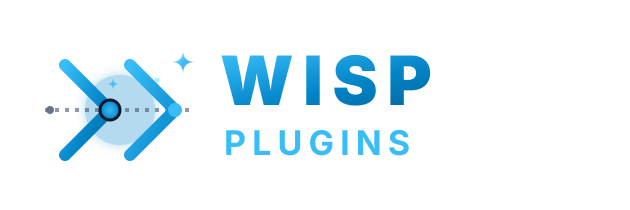

<p align="center">
  
</p>

<p align="center">
  <i>Nine cooperating plugins covering the full development lifecycle, connected by shared JSON schemas and a common verification gate.</i>
</p>

<p align="center">
  <a href="LICENSE"></a>
  <a href="marketplace.json"></a>
  <a href="ARCHITECTURE.md"></a>
</p>

---

## The Lifecycle Ecosystem

Nine plugins cover the complete path from raw idea to shipped release. Each plugin produces a typed output schema consumed by the next stage. They are composable — install only the stages your workflow needs.

```mermaid
flowchart LR
    gr[graph\nneed] -->|requirement@1| tr[trace\nresearch]
    tr -->|research-report@1| ca[canon\nspec]
    ca -->|spec@1| ve[vector\nplan]
    ve -->|plan@1| la[lambda\ncode]
    la -->|changeset@1| ax[axiom\ngate]
    ax -->|verdict@1| de[delta\nship]
    de -. iterate .-> gr

    pr([proof\naudit]) -. finding-report@1 .-> de
    ba([basis\nmeta]) -. scaffold .-> gr
```

| Plugin | Stage | Purpose | Output |
| :--- | :--- | :--- | :--- |
| [`graph`](./plugins/graph/) | Need | Captures and structures requirements | `requirement@1` |
| [`trace`](./plugins/trace/) | Research | Surveys prior art, risks, and patterns | `research-report@1` |
| [`canon`](./plugins/canon/) | Spec | Drafts and gates unambiguous specifications | `spec@1` |
| [`vector`](./plugins/vector/) | Plan | Decomposes specs into sequenced, testable tasks | `plan@1` |
| [`lambda`](./plugins/lambda/) | Code | Implements tasks via TDD, gates on exit | `changeset@1` |
| [`axiom`](./plugins/axiom/) | Gate | Cross-artifact verification gate (reusable) | `verdict@1` |
| [`delta`](./plugins/delta/) | Ship | Commits, PRs, changelogs, and release notes | `release-artifact@1` |
| [`proof`](./plugins/proof/) | Audit | Adversarial bug hunting on live code | `finding-report@1` |
| [`basis`](./plugins/basis/) | Meta | Scaffolds and audits new plugins | — |

---

## Shared Schema Contract

All inter-plugin handoffs are typed. Schemas live in `shared/schemas/` and use JSON Schema draft-2020-12 with `additionalProperties: false`. Schema versions are immutable — a breaking change requires a new file (e.g. `requirement@2.json`). Every schema includes a `reasoning` scratchpad field that is never forwarded downstream.

| Schema | Produced by | Consumed by |
| :--- | :--- | :--- |
| `requirement@1` | graph | trace, canon |
| `research-report@1` | trace | canon |
| `spec@1` | canon | vector, axiom |
| `plan@1` | vector | lambda |
| `changeset@1` | lambda | delta, axiom |
| `verdict@1` | axiom | any gate consumer |
| `finding-report@1` | proof | delta, humans |
| `release-artifact@1` | delta | humans |

---

## Shared References

Runtime-pullable guides in `shared/references/`. Subagents pull these themselves during task execution — they are not loaded into context at startup.

| File | Purpose |
| :--- | :--- |
| `rust.md` | Rust hazard taxonomies, NAPI boundary rules, non-negotiables |
| `typescript.md` | TS hazard taxonomies, unhandled promise patterns |
| `conventional-commits.md` | Type/scope conventions and scope table |
| `github.md` | PR template, `gh` CLI commands, labels |
| `changesets.md` | Changeset vs commit distinction, semver decision guide |
| `mcp-protocol.md` | MCP server lifecycle, tool definition format, A2A AgentCard |
| `modern-cli-tools.md` | ripgrep, fd, bat, jq, delta, fzf usage patterns |

---

## Quick Start

### Claude Code

Add this repo as a marketplace, then install the plugins you need:

```
/plugin marketplace add orin-axi/agent-plugins
/plugin install graph
/plugin install trace
/plugin install canon
/plugin install vector
/plugin install lambda
/plugin install axiom
/plugin install delta
```

Install `proof` and `basis` as needed:

```
/plugin install proof
/plugin install basis
```

### Antigravity (AGY)

Install individual plugins directly:

```bash
agy plugin install graph
agy plugin install trace
agy plugin install canon
# etc.
```

Or use [`agy-plugins-cli`](https://github.com/ZaunEkko/agy-plugins-cli) for full marketplace management:

```bash
npm install -g agy-plugins-cli
agy-plugin marketplace add orin-axi/agent-plugins
agy-plugin add graph@orin-axi
agy-plugin add trace@orin-axi
```

---

## Repository Structure

```
agent-plugins/
├── marketplace.json              ← Plugin registry (v2.0.0)
├── ARCHITECTURE.md               ← System architecture
├── CONTRIBUTING.md               ← Plugin authoring guide
├── shared/
│   ├── schemas/                  ← Versioned inter-agent JSON schemas
│   │   ├── requirement@1.json
│   │   ├── research-report@1.json
│   │   ├── spec@1.json
│   │   ├── plan@1.json
│   │   ├── changeset@1.json
│   │   ├── verdict@1.json
│   │   ├── finding-report@1.json
│   │   └── release-artifact@1.json
│   ├── references/               ← Runtime-pullable domain guides
│   └── agent-best-practices.md  ← Authoring-time principles (Section 9)
└── plugins/
    ├── graph/                    ← Requirement capture
    ├── trace/                    ← Research synthesis
    ├── canon/                    ← Specification drafting and gating
    ├── vector/                   ← Implementation planning
    ├── lambda/                   ← TDD implementation
    ├── axiom/                    ← Verification gate
    ├── delta/                    ← Ship tooling
    ├── proof/                    ← Adversarial bug hunting
    └── basis/                    ← Plugin scaffolding
```

---

## License

MIT © Gabriel Castro (Orin DX)
