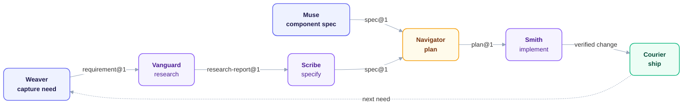
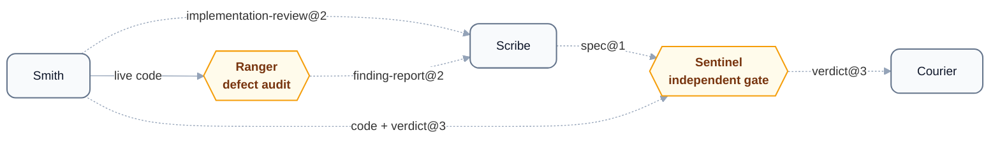

<div align="center">
  
</div>

<p align="center">
  <i>Ten cooperating plugins covering the full development lifecycle, connected by shared JSON schemas and a common verification gate.</i>
</p>

<p align="center">
  <b>Use this when you're building non-trivial software with AI coding agents and need to know every acceptance criterion was implemented and tested — not assumed.</b> The specific problem: agents working across long sessions silently drop criteria as context compresses. Specs live on disk. Agents read from disk. Drift is detectable, not silent.
</p>

<p align="center">
  <a href="LICENSE"></a>
  <a href="marketplace.json"></a>
  <a href="ARCHITECTURE.md"></a>
</p>

---

## Wisp Plugins — the Lifecycle Ecosystem

Ten plugins, each a specialist persona covering one stage of the development lifecycle — together they're **Wisp Plugins**, the agent-side companions to the [Wisp](https://github.com/orin-axi/wisp) project-intelligence library. Lifecycle handoffs use typed artifacts where applicable. The plugins are composable: install only the personas your workflow needs.

**The primary flow** — one direction, no side-taps:



**Verification** — Sentinel and Ranger attach to the flow above but aren't stops in its sequence; the muted dashed boxes below are the same personas shown only as attachment points:



     

*Pill-shaped nodes are cross-cutting checkpoints, not sequence stops. Solid arrows are direct handoffs; dashed arrows are verification side-channels. Ranger's input is the live codebase Smith just wrote, not a schema handoff — the one solid arrow in the second diagram.*

Smith repairs scoped defect families before its exit gate. Structural families route through `scribe:architect`, the normal spec gates, Navigator plan amendment, and Smith implementation; after verification, Scribe refreshes the persisted architecture model.

Grouped by what each persona actually does — five bands across the lifecycle, plus one that stands outside it and maintains the rest:

| Category | Persona | Job | Output |
| :--- | :--- | :--- | :--- |
| **Define** | [`weaver`](./plugins/weaver/) | Captures and structures scattered need into requirements | `requirement@1` |
| **Define** | [`vanguard`](./plugins/vanguard/) | Goes first — researches prior art, risk, and patterns before anyone commits to a direction | `research-report@1` |
| **Design** | [`scribe`](./plugins/scribe/) | Drafts and gates the unambiguous, binding spec | `spec@1` |
| **Design** | [`muse`](./plugins/muse/) | Drafts and gates component specs — props, variants, per-state behavior, accessibility | `spec@1` |
| **Build** | [`navigator`](./plugins/navigator/) | Decomposes the spec into an executable plan | `plan@1` |
| **Build** | [`smith`](./plugins/smith/) | Implements, selects risk-matched tests, reviews defect families, and verifies criteria | `implementation-review@2`, `verdict@3` |
| **Verify** | [`sentinel`](./plugins/sentinel/) | Cross-cutting gate — confirms any artifact meets its criteria before the next stage begins | `verdict@3` |
| **Verify** | [`ranger`](./plugins/ranger/) | Hunts reachable defects and semantic siblings in Rust, TypeScript, JavaScript, Python, and Go | `finding-report@2` |
| **Ship** | [`courier`](./plugins/courier/) | Commits, opens PRs, responds to review, writes changelogs and release notes | `release-artifact@2` |
| **Meta** | [`mason`](./plugins/mason/) | Scaffolds and audits plugins, designs schemas, and evaluates workflow behavior | `harness-evaluation@2` |

---

## Install

### One Ecosystem, Two Harnesses

This repository publishes the same lifecycle ecosystem to Claude Code and Codex without pretending their runtimes are interchangeable. The durable boundary is the versioned JSON artifact in `shared/schemas/`; a requirement, research report, spec, or plan can move between harnesses when it validates against the same schema.

| Concern | Claude Code | Codex | Source of truth |
| :--- | :--- | :--- | :--- |
| Shared ID, version, author, and artifact declarations | Uses `plugins/<id>/plugin.json` | Native manifest is checked against those shared fields | `plugins/<id>/plugin.json` |
| Workflow prompts | Skills plus specialist agent prompts | Native Codex skills | Claude: `plugins/<id>/`; Codex: `harnesses/codex/plugins/<id>/` |
| Durable handoffs | Versioned JSON artifacts | The same versioned JSON artifacts, materialized as regular files | `shared/schemas/` |
| Installable marketplace | Root Claude marketplace files | Root discovery manifest plus generated bundle | `.agents/plugins/marketplace.json` and `dist/codex/` |

`plugins/` is the authored source for the existing Claude/AGY marketplace. `harnesses/codex/plugins/<id>/` contains separately authored Codex manifests, skills, and optional resources. `harnesses/codex/catalog.json` controls marketplace order and materialized runtime files only. `tools/build-codex-marketplace.py` validates and packages those inputs into `dist/codex`, then emits `.agents/plugins/marketplace.json` at the repository root so Codex can discover the bundle from Git. Do not edit generated files by hand.

Claude agents are not renamed and shipped as Codex agents. Each Codex skill has its own harness-appropriate instructions and can complete alone. When agent teams are enabled, a skill selects a packaged Codex role card for independent, bounded work; the artifact contract and single-agent result remain the same. Codex role cards are portable plugin resources, not TOML configuration.

### Claude Code

Add the repository marketplace from inside Claude Code, then install the plugins you want:

```
/plugin marketplace add orin-dx/agent-plugins
/plugin install weaver
/plugin install vanguard
/plugin install scribe
/plugin install navigator
/plugin install smith
```

Add `muse` for component specifications, `sentinel` and `ranger` for verification, `courier` for shipping work, and `mason` for plugin authoring:

```
/plugin install muse
/plugin install sentinel
/plugin install ranger
/plugin install courier
/plugin install mason
```

If you registered the previous marketplace identity, replace it before installing from Wisp Plugins:

```
/plugin marketplace remove orin-dx-agent-plugins
/plugin marketplace add orin-dx/agent-plugins
```

### Codex

Codex discovers the generated root manifest at `.agents/plugins/marketplace.json`; it points at the generated `dist/codex` bundle. Register the repository once, then add only the plugins you need:

```bash
codex plugin marketplace add orin-dx/agent-plugins
codex plugin add weaver@wisp-plugins
codex plugin add vanguard@wisp-plugins
codex plugin add scribe@wisp-plugins
codex plugin add navigator@wisp-plugins
codex plugin add smith@wisp-plugins
```

Other available selectors are `muse`, `sentinel`, `ranger`, `courier`, and `mason`. Inspect marketplace availability with:

```bash
codex plugin list
```

To refresh the registered Git marketplace after a release:

```bash
codex plugin marketplace upgrade wisp-plugins
```

For contributors using a local checkout, rebuild and verify the bundle before registering it:

```bash
python3 tools/build-codex-marketplace.py
python3 tools/build-codex-marketplace.py --check
codex plugin marketplace add .
```

If you previously registered the marketplace as `orin-dx-agent-plugins`, migrate to the Wisp Plugins identity:

```bash
codex plugin marketplace remove orin-dx-agent-plugins
codex plugin marketplace add orin-dx/agent-plugins
codex plugin add <plugin>@wisp-plugins
```

### Session History Across Agent Hosts

Entire-managed adapters expose the same repository-history search skill to Codex, Claude, Cursor, Gemini, and OpenCode. Cursor and OpenCode also carry host-native lifecycle hooks. These tracked files contain commands and adapter code—not session transcripts, credentials, or machine-specific paths—and should be regenerated through Entire rather than edited by hand.

### Antigravity (AGY)

Install individual plugins via the native CLI (uses a Git URL):

```bash
agy plugin install https://github.com/orin-dx/agent-plugins.git
```

Or use [`agy-plugins-cli`](https://github.com/ZaunEkko/agy-plugins-cli) for an interactive TUI with update tracking:

```bash
npm install -g agy-plugins-cli
agy-plugin marketplace add orin-dx/agent-plugins
agy-plugin add weaver@wisp-plugins
agy-plugin add vanguard@wisp-plugins
agy-plugin add scribe@wisp-plugins
agy-plugin add muse@wisp-plugins
agy-plugin add navigator@wisp-plugins
agy-plugin add smith@wisp-plugins
agy-plugin add sentinel@wisp-plugins
agy-plugin add courier@wisp-plugins
agy-plugin add ranger@wisp-plugins
agy-plugin add mason@wisp-plugins
```

---

## Design Principles

Six decisions shape how every plugin and agent in this repository is built. They are enforced by `shared/constitution.md` and explained in `shared/agent-best-practices.md`.

**Schema-Driven Development** — every handoff between agents is a typed JSON document.
- JSON Schema draft-2020-12 with `additionalProperties: false` — a schema-invalid output halts the pipeline before any downstream agent acts on bad data
- Schema versions are immutable — a breaking change creates `<name>@2.json`, never mutates the existing file
- Every schema includes a private `reasoning` scratchpad field that is never forwarded downstream

**EARS output contracts** — hard constraints live exclusively in `<output>` sections, using `WHEN / IF / WHILE / WHERE / THE SYSTEM SHALL`.
- Encodes what the agent must produce, must not produce, or must do under a specific condition
- The prompt interior — how the agent searches, reasons, and decides — is intentionally unconstrained
- EARS is the fence; backstory and goal fill the interior with judgment

**5-part agent structure** — every Claude/AGY source agent body has exactly five sections; no role labels, no success-criteria checklists. Codex skills and role cards use native structures while preserving lifecycle intent.
- `<constitution>` — ecosystem-wide invariants, byte-identical across every agent (copied verbatim, never authored per-agent)
- `<backstory>` — experiential perspective that shapes judgment in open situations (not a role label)
- `<goal>` — intent, not steps
- `<judgment>` — the specific failure mode that looks like success
- `<output>` — schema reference and EARS contracts

**Cognitive mode separation** — agents are dispatched by the cognitive mode they require, not their pipeline position.
- A scanner (exhaustive pattern matching, no filtering) and an adversary (default-to-skepticism, requires a concrete failing scenario) cannot share a mental mode — combining them produces an agent worse at both
- Model and effort tiers follow the same logic: `haiku / low` for enumeration, `sonnet / medium` for analysis, `opus / high` for binding judgment

**Instruction economy** — prompts preserve decisions, evidence, and consequences while removing filler, repeated rationale, and incidental process.

- One independently actionable rule per paragraph or list item
- Numbered procedures only when order affects correctness
- Reference files hold detail needed by one phase; runtime prompts load it on demand

**Verification evidence** — a check is useful only when its observation can falsify the claim.

- Select project-native mutation, property, fuzz, race, integration, or boundary checks from the changed risk
- Derive semantic sibling candidates from domain responsibility, state transitions, and architecture—not copied syntax alone
- Record generators, oracles, coverage gaps, pending checks, fresh external state, and boundary observations where relevant

See [`ARCHITECTURE.md §7`](./ARCHITECTURE.md#7-agent-authoring-principles) for the full authoring guide, and [`docs/pipeline-walkthrough.md`](./docs/pipeline-walkthrough.md) for a concrete end-to-end example showing schemas at each stage.

---

## Shared Schema Contract

Structured inter-plugin handoffs are typed. Schemas live in `shared/schemas/` and use JSON Schema draft-2020-12 with `additionalProperties: false`. Schema versions are immutable — a breaking change requires a new file (e.g. `requirement@2.json`). Every schema includes a `reasoning` scratchpad field that is never forwarded downstream.

| Schema | Produced by | Consumed by |
| :--- | :--- | :--- |
| `requirement@1` | weaver | vanguard, scribe |
| `research-report@1` | vanguard | scribe |
| `spec@1` | scribe, muse | navigator, sentinel |
| `verdict@1` | muse | component-spec gate consumers |
| `plan@1` | navigator | smith |
| `workspace-manifest@1` | smith, ranger | their implementation and audit pipelines |
| `implementation-result@1` | smith implementer | smith reviewer, scribe architect on escalation |
| `implementation-review@2` | smith | smith exit-gate, scribe architect |
| `changeset@2` | courier | courier release, sentinel |
| `verdict@3` | scribe, smith, ranger, sentinel | gate consumers and humans |
| `candidate-assessment@1` | ranger adversary | ranger report aggregation |
| `finding-report@2` | ranger | scribe architect, humans |
| `field-survival-map@1` | boundary-tracer | adversary |
| `mutation-report@2` | smith mutator | reviewer, implementer |
| `evaluation-run@1` | mason evaluation runner | mason evaluation adjudicator |
| `harness-evaluation@2` | mason | release reviewers and longitudinal analysis |
| `arch-audit@1` | scribe | architecture-gate callers and humans |
| `arch-model@1` | scribe | scribe architecture checks and remediation |
| `release-artifact@2` | courier | humans |

`verdict@1` remains Muse's component-spec gate contract. Other current gates use `verdict@3`; immutable schema versions are not rewritten in place.

---

## Shared References

Runtime-pullable guides in `shared/references/`. Agents pull these themselves during task execution — they are not loaded into context at startup. Language reference files are split by concern so each agent loads only its phase slice.

| File | Purpose | Loaded by |
| :--- | :--- | :--- |
| `rust-hazards.md` | Rust hazard taxonomies T1–T6/T8/T9, grep patterns, before/after examples | scanner, adversary, Smith reviewer |
| `rust-hazards-t7-t10.md` | Rust taxonomies T7 and T10 | boundary-tracer, scanner, adversary, Smith reviewer |
| `rust-smells.md` | Rust architectural smells and resolving trait designs | architect, Smith reviewer |
| `rust-tooling.md` | Rust test commands, NAPI rules, non-negotiables | mutator, remediator |
| `rust.md` | Thin index → routes to the files above | — |
| `typescript-hazards.md` | TS hazard taxonomies T1–T6/T8/T9, grep patterns, before/after examples | scanner, adversary, Smith reviewer |
| `typescript-hazards-t7-t10.md` | TS taxonomies T7 and T10 | boundary-tracer, scanner, adversary, Smith reviewer |
| `typescript-smells.md` | TS architectural smells and interface/type designs | architect, Smith reviewer |
| `typescript-tooling.md` | TS test commands (Stryker, Vitest), non-negotiables | mutator, remediator |
| `typescript.md` | Thin index → routes to the files above | — |
| `python-hazards.md` | Python hazards outside T7/T10 | Ranger scanner and adversary, Smith reviewer |
| `python-hazards-t7-t10.md` | Python intent-loss and error-downgrade hazards | Ranger boundary tracer, scanner, and adversary; Smith reviewer |
| `python-smells.md` | Python architectural smells and structural remedies | Scribe architect, Smith reviewer |
| `python-tooling.md` | Python-native test, mutation, property, and fuzz options | Smith implementer and mutator |
| `python.md` | Thin index → routes to the Python files above | — |
| `go-hazards.md` | Go hazards outside T7/T10 | Ranger scanner and adversary, Smith reviewer |
| `go-hazards-t7-t10.md` | Go intent-loss and error-downgrade hazards | Ranger boundary tracer, scanner, and adversary; Smith reviewer |
| `go-smells.md` | Go architectural smells and structural remedies | Scribe architect, Smith reviewer |
| `go-tooling.md` | Go-native test, fuzz, race, and mutation options | Smith implementer and mutator |
| `go.md` | Thin index → routes to the Go files above | — |
| `verification-evidence.md` | Risk-to-evidence selection across boundaries, generated inputs, state, and completion | Smith implementation and review |
| `behavioral-evaluation.md` | Hidden-oracle, provenance-complete workflow evaluation | Mason evaluation |
| `conventional-commits.md` | Type/scope conventions and scope table | courier |
| `github.md` | PR template, `gh` CLI commands, labels | courier |
| `changesets.md` | Changeset vs commit distinction, semver decision guide | courier |
| `mcp-protocol.md` | MCP server lifecycle, tool definition format, A2A AgentCard | — |
| `modern-cli-tools.md` | ripgrep, fd, bat, jq, delta, fzf usage patterns | — |
| `interface-implementers.md` | Deterministic pre-scan for enumerating trait/interface implementers per language | challenger |
| `boundary-value-shapes.md` | Sum-type-over-bool default posture for boundary-crossing values, per-language examples | implementer |
| `implementation-review.md` | Routes implementation review to language hazards, architecture smells, and comment rules | Smith reviewer |
| `architecture-remediation.md` | Routes structural remediation to the persisted model and language smells | Scribe architect |
| `code-comments.md` | Reader-scoped doc and inline comment rules | implementer, Smith reviewer |
| `workspace-conventions.md` | Persisted spec, plan, and architecture-model locations | recon and coverage auditors |
| `docs-voice.md` | Reader-focused prose and review-label conventions | Courier authoring references |
| `orin-visual-standard.md` | Shared Mermaid palette and diagram conventions | documentation authors |

---

## Repository Structure

```
agent-plugins/
├── marketplace.json              ← Plugin registry
├── .claude-plugin/               ← Claude marketplace metadata
├── ARCHITECTURE.md               ← System architecture
├── CONTRIBUTING.md               ← Plugin authoring guide
├── harnesses/
│   └── codex/
│       ├── catalog.json          ← Marketplace order and runtime dependencies
│       └── plugins/<id>/         ← Authored native Codex plugins and skills
├── shared/
│   ├── schemas/                  ← Versioned inter-agent JSON schemas
│   ├── references/               ← Runtime-pullable domain guides (split by concern)
│   └── agent-best-practices.md  ← Authoring-time principles
├── plugins/
    ├── weaver/                    ← Requirement capture
    ├── vanguard/                  ← Research synthesis
    ├── scribe/                    ← Specification drafting and gating
    ├── muse/                      ← Component spec drafting and gating
    ├── navigator/                 ← Implementation planning
    ├── smith/                     ← Implementation and risk-matched verification
    ├── sentinel/                  ← Verification gate
    ├── courier/                   ← Ship tooling
    ├── ranger/                    ← Cross-language reachable-defect audit
    └── mason/                     ← Plugin authoring and behavioral evaluation
├── .agents/
│   ├── plugins/                   ← Generated Codex discovery manifest; never hand-edit
│   └── skills/entire-search/      ← Entire-managed Codex history search
├── .claude/skills/entire-search/  ← Entire-managed Claude history search
├── .cursor/                       ← Entire-managed Cursor skill and hooks
├── .gemini/skills/entire-search/  ← Entire-managed Gemini history search
├── .opencode/                     ← Entire-managed OpenCode skill and plugin
├── tools/
│   └── build-codex-marketplace.py ← Deterministic Codex bundle generator
└── dist/codex/                    ← Generated Codex bundle; never hand-edit
```

---

## License

MIT © Gabriel Castro (Orin DX)
