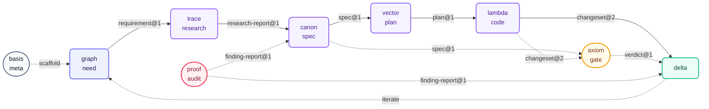

<div align="center">
  
</div>

<p align="center">
  <i>Nine cooperating plugins covering the full development lifecycle, connected by shared JSON schemas and a common verification gate.</i>
</p>

<p align="center">
  <b>Use this when you're building non-trivial software with AI coding agents and need to know every acceptance criterion was implemented and tested — not assumed.</b> The specific problem: agents working across long sessions silently drop criteria as context compresses. Specs live on disk. Agents read from disk. Drift is detectable, not silent.
</p>

<p align="center">
  <a href="LICENSE"></a>
  <a href="marketplace.json"></a>
  <a href="ARCHITECTURE.md"></a>
</p>

---

## The Lifecycle Ecosystem

Nine plugins cover the complete path from raw idea to shipped release. Each plugin produces a typed output schema consumed by the next stage. They are composable — install only the stages your workflow needs.



| Plugin | Stage | Purpose | Output |
| :--- | :--- | :--- | :--- |
| [`graph`](./plugins/graph/) | Need | Captures and structures requirements | `requirement@1` |
| [`trace`](./plugins/trace/) | Research | Surveys prior art, risks, and patterns | `research-report@1` |
| [`canon`](./plugins/canon/) | Spec | Drafts and gates unambiguous specifications | `spec@1` |
| [`vector`](./plugins/vector/) | Plan | Decomposes specs into sequenced, testable tasks | `plan@1` |
| [`lambda`](./plugins/lambda/) | Code | Implements tasks via TDD, gates on exit | `changeset@2` |
| [`axiom`](./plugins/axiom/) | Gate | Cross-artifact verification gate (reusable) | `verdict@1` |
| [`delta`](./plugins/delta/) | Ship | Commits, PRs, changelogs, and release notes | `release-artifact@2` |
| [`proof`](./plugins/proof/) | Audit | Fast cross-language bug scan before any release | `finding-report@1` |
| [`basis`](./plugins/basis/) | Meta | Scaffolds and audits new plugins | — |

---

## Design Principles

Four decisions shape how every plugin and agent in this repository is built. They are enforced by `shared/constitution.md` and explained in `shared/agent-best-practices.md`.

**Schema-Driven Development** — every handoff between agents is a typed JSON document.
- JSON Schema draft-2020-12 with `additionalProperties: false` — a schema-invalid output halts the pipeline before any downstream agent acts on bad data
- Schema versions are immutable — a breaking change creates `<name>@2.json`, never mutates the existing file
- Every schema includes a `reasoning` scratchpad field for chain-of-thought; never forwarded downstream

**EARS output contracts** — hard constraints live exclusively in `<output>` sections, using `WHEN / IF / WHILE / WHERE / THE SYSTEM SHALL`.
- Encodes what the agent must produce, must not produce, or must do under a specific condition
- The prompt interior — how the agent searches, reasons, and decides — is intentionally unconstrained
- EARS is the fence; backstory and goal fill the interior with judgment

**5-part agent structure** — every agent body has exactly five sections; no role labels, no success-criteria checklists.
- `<constitution>` — ecosystem-wide invariants, byte-identical across every agent (copied verbatim, never authored per-agent)
- `<backstory>` — experiential perspective that shapes judgment in open situations (not a role label)
- `<goal>` — intent, not steps
- `<judgment>` — the specific failure mode that looks like success
- `<output>` — schema reference and EARS contracts

**Cognitive mode separation** — agents are dispatched by the cognitive mode they require, not their pipeline position.
- A scanner (exhaustive pattern matching, no filtering) and an adversary (default-to-skepticism, requires a concrete failing scenario) cannot share a mental mode — combining them produces an agent worse at both
- Model and effort tiers follow the same logic: `haiku / low` for enumeration, `sonnet / medium` for analysis, `opus / high` for binding judgment

See [`ARCHITECTURE.md §7`](./ARCHITECTURE.md#7-agent-authoring-principles) for the full authoring guide, and [`docs/pipeline-walkthrough.md`](./docs/pipeline-walkthrough.md) for a concrete end-to-end example showing schemas at each stage.

---

## Shared Schema Contract

All inter-plugin handoffs are typed. Schemas live in `shared/schemas/` and use JSON Schema draft-2020-12 with `additionalProperties: false`. Schema versions are immutable — a breaking change requires a new file (e.g. `requirement@2.json`). Every schema includes a `reasoning` scratchpad field that is never forwarded downstream.

| Schema | Produced by | Consumed by |
| :--- | :--- | :--- |
| `requirement@1` | graph | trace, canon |
| `research-report@1` | trace | canon |
| `spec@1` | canon | vector, axiom |
| `plan@1` | vector | lambda |
| `changeset@2` | lambda | delta, axiom |
| `verdict@1` | axiom | any gate consumer |
| `finding-report@1` | proof | delta, humans, architect |
| `field-survival-map@1` | boundary-tracer | adversary |
| `mutation-report@1` | mutator | exit-gate, implementer |
| `release-artifact@2` | delta | humans |

---

## Shared References

Runtime-pullable guides in `shared/references/`. Agents pull these themselves during task execution — they are not loaded into context at startup. Language reference files are split by concern so each agent loads only its phase slice.

| File | Purpose | Loaded by |
| :--- | :--- | :--- |
| `rust-hazards.md` | Rust hazard taxonomies T1–T6/T8/T9, grep patterns, before/after examples | scanner (always), adversary (non-T7/T10) |
| `rust-hazards-t7-t10.md` | Rust taxonomies T7 and T10 — boundary-tracer's entire scope | boundary-tracer (always), scanner (full scans), adversary (T7/T10) |
| `rust-smells.md` | Rust architectural smells and resolving trait designs | architect |
| `rust-tooling.md` | Rust test commands, NAPI rules, non-negotiables | mutator, remediator |
| `rust.md` | Thin index → routes to the files above | — |
| `typescript-hazards.md` | TS hazard taxonomies T1–T6/T8/T9, grep patterns, before/after examples | scanner (always), adversary (non-T7/T10) |
| `typescript-hazards-t7-t10.md` | TS taxonomies T7 and T10 — boundary-tracer's entire scope | boundary-tracer (always), scanner (full scans), adversary (T7/T10) |
| `typescript-smells.md` | TS architectural smells and interface/type designs | architect |
| `typescript-tooling.md` | TS test commands (Stryker, Vitest), non-negotiables | mutator, remediator |
| `typescript.md` | Thin index → routes to the files above | — |
| `conventional-commits.md` | Type/scope conventions and scope table | delta |
| `github.md` | PR template, `gh` CLI commands, labels | delta |
| `changesets.md` | Changeset vs commit distinction, semver decision guide | delta |
| `mcp-protocol.md` | MCP server lifecycle, tool definition format, A2A AgentCard | — |
| `modern-cli-tools.md` | ripgrep, fd, bat, jq, delta, fzf usage patterns | — |
| `interface-implementers.md` | Deterministic pre-scan for enumerating trait/interface implementers per language | challenger |
| `boundary-value-shapes.md` | Sum-type-over-bool default posture for boundary-crossing values, per-language examples | implementer |

---

## Quick Start

### Claude Code

Add this repo as a marketplace, then install the plugins you need:

```
/plugin marketplace add orin-dx/agent-plugins
/plugin install graph
/plugin install trace
/plugin install canon
/plugin install vector
/plugin install lambda
/plugin install axiom
/plugin install delta
```

Install `proof` and `basis` as needed:

```
/plugin install proof
/plugin install basis
```

### Antigravity (AGY)

Install individual plugins via the native CLI (uses a Git URL):

```bash
agy plugin install https://github.com/orin-dx/agent-plugins.git
```

Or use [`agy-plugins-cli`](https://github.com/ZaunEkko/agy-plugins-cli) for an interactive TUI with update tracking:

```bash
npm install -g agy-plugins-cli
agy-plugin marketplace add orin-dx/agent-plugins
agy-plugin add graph@orin-dx
agy-plugin add trace@orin-dx
agy-plugin add canon@orin-dx
agy-plugin add vector@orin-dx
agy-plugin add lambda@orin-dx
agy-plugin add axiom@orin-dx
agy-plugin add delta@orin-dx
agy-plugin add proof@orin-dx
agy-plugin add basis@orin-dx
```

---

## Repository Structure

```
agent-plugins/
├── marketplace.json              ← Plugin registry
├── ARCHITECTURE.md               ← System architecture
├── CONTRIBUTING.md               ← Plugin authoring guide
├── shared/
│   ├── schemas/                  ← Versioned inter-agent JSON schemas
│   ├── references/               ← Runtime-pullable domain guides (split by concern)
│   └── agent-best-practices.md  ← Authoring-time principles
└── plugins/
    ├── graph/                    ← Requirement capture
    ├── trace/                    ← Research synthesis
    ├── canon/                    ← Specification drafting and gating
    ├── vector/                   ← Implementation planning
    ├── lambda/                   ← TDD implementation
    ├── axiom/                    ← Verification gate
    ├── delta/                    ← Ship tooling
    ├── proof/                    ← Fast cross-language bug scan
    └── basis/                    ← Plugin scaffolding
```

---

## License

MIT © Gabriel Castro (Orin DX)
