# canon — Specification

**Stage:** Spec · **Output:** `spec@1` · **Version:** 2.1.0

Turns requirements into unambiguous, testable specs a developer can implement without a single clarifying question — and keeps them that way after implementation starts.

- **Drafts, audits, and gates** specs against that standard; an adversarial exit gate enforces it, default disposition fail
- **Designs structural remediation specs** from proof's defect-class findings
- **Detects drift** between a gated spec and the live codebase
- **Revises a gated spec** when implementation reveals it was wrong

Once gated, the spec is written to disk and committed — downstream agents read it from the file, never from conversation context.

Seven independently-triggered skills, not a linear pipeline — pick the one that matches the task.

---

## When to Use

- You have a `requirement@1` (and optionally a `research-report@1`) and are ready to write a spec
- You need to verify that a draft spec's acceptance criteria are grounded in the source requirement
- You want to audit a spec for vague criteria, missing error cases, or unverifiable claims
- You need a binding pass/fail gate on a spec before it enters planning
- proof has returned a `finding-report@1` and the defect class requires a structural fix, not a patch
- You want to check whether the live codebase still matches a spec gated weeks or months ago
- implementer reported that a criterion contradicts observed system behavior and the spec itself needs correcting

**Invoke with:** `"Write a spec for this requirement"`, `"Draft a spec based on this research"`, `"Verify this spec against the requirement"`, `"Audit this spec"`, `"Gate this spec"`, `"Design the structural fix for this defect class"`, `"Check this spec for drift"`, `"Correct this spec — the criterion doesn't match reality"`

---

## Skills

| Skill | What it does | Subagent |
| :--- | :--- | :--- |
| `canon/draft-spec` | Drafts a `spec@1` from a `requirement@1` and optional `research-report@1` — no TBDs permitted | `drafter` |
| `canon/verify-spec` | Checks that each acceptance criterion is grounded in the source requirement or research report | `verifier` |
| `canon/spec-drift` | Checks whether the live codebase still implements every criterion in a gated spec — covered, uncovered, or drifted | `drift-checker` |
| `canon/audit-spec` | Adversarially reviews a spec for vague criteria, missing error cases, and unverifiable claims | `auditor` |
| `canon/gate-spec` | Binding pass/fail verdict before the spec enters planning; writes the passed spec to disk | `exit-gate` |
| `canon/correct-spec` | Revises a previously gated spec after implementer reports a criterion contradicts observed system behavior | `drafter` (correction mode) |
| `canon/architect` | Produces a structural remediation `spec@1` from a `finding-report@1` — eliminates the defect class, not the instances | `architect` |

`audit-spec` and `gate-spec` are not bare `audit`/`gate` — those words are already taken by `proof` and `axiom`'s own plugin-level skills. See `shared/constitution.md`'s Skill Names rule.

---

## Subagents

| Subagent | Role | Tier | Description |
| :--- | :--- | :--- | :--- |
| `drafter` | Drafter | sonnet / medium | Produces a `spec@1` from a `requirement@1` and optional `research-report@1`, or revises a gated spec in correction mode. No TBDs permitted. |
| `verifier` | Draft Verifier | sonnet / medium | Checks that acceptance criteria are grounded in the source artifacts (pre-implementation only). Neutral — collects evidence only. |
| `drift-checker` | Drift Detector | opus / high | On-demand, post-implementation: reads the spec from disk and the code from the workspace, classifies each criterion as covered, uncovered, or drifted. When a prior changeset's `criteria_evidence` is available, uses its pointers as a starting point but always independently re-verifies each one. |
| `auditor` | Auditor | sonnet / medium | Adversarially reviews the spec for vague criteria, missing error cases, ambiguous language, and incomplete sections. |
| `exit-gate` | Exit Gate | opus / high | Binding pass/fail verdict before the spec enters planning. Default disposition: fail. |
| `architect` | Architectural Remediator | opus / high | Takes a `finding-report@1` from proof and produces a `spec@1` for the structural fix that eliminates the defect class. |

---

## Pipelines

**Standard drafting pipeline:**

```mermaid
flowchart LR
    classDef source fill:#eef2ff,stroke:#6366f1,stroke-width:2px,color:#1e1b4b,rx:8px,ry:8px;
    classDef engine fill:#f5f3ff,stroke:#8b5cf6,stroke-width:2px,color:#4c1d95,rx:8px,ry:8px;
    classDef router fill:#fffbeb,stroke:#f59e0b,stroke-width:2px,color:#78350f,rx:8px,ry:8px;
    classDef output fill:#ecfdf5,stroke:#10b981,stroke-width:2px,color:#064e3b,rx:8px,ry:8px;

    Req["requirement@1
    + research-report@1"] --> Draft["canon/draft-spec
    drafter"]
    Draft --> Verify["canon/verify-spec
    verifier"]
    Verify --> Audit["canon/audit-spec
    auditor"]
    Audit --> Gate["canon/gate-spec
    exit-gate"]
    Gate -->|pass| Spec(["spec@1
    written + committed"])

    class Req source
    class Draft,Verify,Audit engine
    class Gate router
    class Spec output
```


**On-demand drift check (maintenance, any time after implementation):**
```
spec_file_path + workspace root
  → canon/spec-drift (drift-checker)
  → drift report (covered / uncovered / drifted)
```

**Correction pipeline (triggered by an implementer spec_contradiction report):**
```
spec_file_path + criterion_id + contradiction report
  → canon/correct-spec (drafter, correction mode)
  → canon/verify-spec → canon/audit-spec → canon/gate-spec
  → [skill overwrites the same file, sets revision_note, commits]
  → corrected spec@1 → planner (amend mode) → lambda resumes
```

**Architectural remediation pipeline (invoked after proof):**
```
finding-report@1
  → canon/architect (architect)
  → canon/gate-spec (exit-gate)
  → spec@1 (architectural)
  → vector → lambda
```

`canon/verify-spec` checks draft specs against their source artifacts pre-implementation — it does not detect drift after code exists; that is `canon/spec-drift`'s job. `canon/architect` is not part of the standard drafting pipeline: it is invoked when proof returns a finding report and the root cause is structural.

---

## Exit Gate Conditions

`canon/gate-spec` enforces four conditions. All must pass:

1. Every acceptance criterion is a testable proposition (binary true/false from outside the system)
2. No TBDs remain
3. Error cases are marked `is_error_case: true`
4. Scope fits a single planning cycle

On fail, specific blockers are returned to `canon/draft-spec` or `canon/architect` for targeted retry. Maximum 3 retries before escalation to a human.

---

## Output Schemas

**`spec@1`** — see `shared/schemas/spec@1.json`

| Field | Required | Description |
| :--- | :--- | :--- |
| `id` | yes | Unique spec identifier |
| `purpose` | yes | One-sentence statement of what this spec accomplishes |
| `scope` | yes | What is in scope for this spec |
| `non_goals` | yes | Explicit list of what this spec does NOT cover |
| `acceptance_criteria` | yes | Array of testable propositions; each has `is_error_case` flag |
| `spec_file_path` | no | Workspace-relative path where this spec is written on disk. Set by `canon/gate-spec` after pass. |
| `revision_note` | no | Set only on a correction — what changed and why, citing the affected criterion_id |
| `reasoning` | yes | Scratchpad — never forwarded downstream |

**`verdict@1`** — produced by `canon/gate-spec` only; see `shared/schemas/verdict@1.json`

---

## Install

**Claude Code** — add the marketplace once, then install by ID:
```
/plugin marketplace add orin-dx/agent-plugins
/plugin install canon
```

**AGY** — installs the full repo; see the [root README](../../README.md#quick-start) for instructions.

---

## Next Stage

Feed `spec@1` to **[vector](../vector/)** (implementation planning) or run it through **[axiom](../axiom/)** for standalone verification against an existing implementation.

When **[proof](../proof/)** produces a `finding-report@1`, feed it to `canon/architect` to design the structural remediation before returning to vector.
