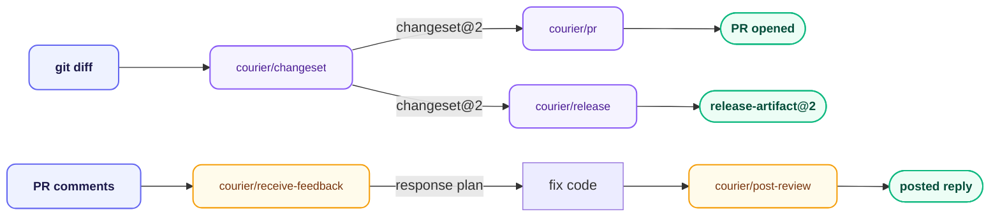

# courier — Ship Tooling

**Stage:** Ship · **Output:** `release-artifact@2` · **Version:** 3.0.0

Handles everything after implementation: commit messages, PR descriptions, changeset extraction, review triage, posting a review, and release notes. Courier is not a linear pipeline — six independently-triggered skills, each dispatching to the subagent that matches the task. It reads the staged diff, linked spec, and linked requirement at runtime to produce meaningful, context-aware output, not mechanical templates.

Courier does not critique code quality or spec conformance — that's the built-in `code-review` skill and `sentinel`'s job respectively. Courier consumes their findings when relevant (e.g. `courier/post-review` can post an already-drafted `code-review` finding) rather than re-implementing them.

---

## When to Use

- You need a commit message that explains *why*, not just *what*
- You're opening a PR and want a description a reviewer with zero context can act on
- You need full context (diff, spec, tests, open questions) before responding to PR review comments
- You have an already-drafted review or reply and want it posted to GitHub
- You're cutting a release and need user-facing release notes
- You want to extract a `changeset@2` from a git diff for semantic versioning, classified from a consumer's perspective

**Invoke with:** `"Commit this"`, `"Write a commit message"`, `"Open a PR"`, `"Write the PR description"`, `"Address the feedback"`, `"Respond to review comments"`, `"Post this review"`, `"Cut a release"`, `"What's in this release"`, `"Add a changeset"`

---

## Install

**Claude Code** — add the marketplace once, then install by ID:
```
/plugin marketplace add orin-dx/agent-plugins
/plugin install courier
```

**AGY** — installs the full repo; see the [root README](../../README.md#install) for instructions.

**Codex** — see the [root Codex setup](../../README.md#codex), then run `codex plugin add courier@wisp-plugins`.

---

## Skills

| Skill | What it does | Subagent |
| :--- | :--- | :--- |
| `courier/commit` | Reads staged diff, produces a conventional commit message explaining the *why* | `commit-analyzer` |
| `courier/pr` | Produces a PR title and body a reviewer with zero prior context can understand, opens the PR after confirmation | `pr-narrator` |
| `courier/changeset` | Splits a diff into independent topics if it has more than one, classifies consumer_impact and semver_impact per topic, and writes a changeset whose detail scales with that classification | `changeset-analyzer` |
| `courier/receive-feedback` | Assembles the review package (diff, linked spec, test results, open questions) for feedback received on the user's own PR | `review-preprocessor` |
| `courier/post-review` | Posts an already-drafted review or reply via `gh pr review`/`gh pr comment`, gated by explicit confirmation | none — mechanical orchestration only |
| `courier/release` | Aggregates changesets since the last release; version is `max(semver_impact)` across included changesets | `release-summarizer` |

---

## Subagents

| Subagent | Role | Tier | Description |
| :--- | :--- | :--- | :--- |
| `commit-analyzer` | Commit Author | haiku / low | Reads staged diff and produces a conventional commit message explaining why, not what. |
| `changeset-analyzer` | Changeset Extractor | sonnet / medium | Classifies `consumer_impact` and `semver_impact` from a git diff per the decision table in `changesets.md`, then produces a `changeset@2` whose summary detail scales with that classification. |
| `pr-narrator` | PR Author | sonnet / medium | Writes a PR title and body from the reviewer's perspective — zero prior context assumed. |
| `review-preprocessor` | Review Package Assembler | haiku / low | Bundles the diff, linked spec, test results, and open questions into a structured review package. Does not categorize comments — that's the caller's call, made with `shared/references/github.md`'s vocabulary. |
| `release-summarizer` | Release Author | sonnet / medium | Aggregates `changeset@2` entries into a `release-artifact@2`, computing the version as `max(semver_impact)` and filtering `internal-only` entries. |

`courier/post-review` has no subagent — posting is mechanical execution of already-drafted content, gated by user confirmation, not a judgment task.

---

## Pipeline



`fix code` is the one step courier doesn't do — a human or `smith` closes that gap before `courier/post-review` picks back up.

---

## Output Schemas

- `changeset@2` — see `shared/schemas/changeset@2.json` (supersedes `changeset@1`, still valid but legacy — adds required `consumer_impact`/`semver_impact`)
- `release-artifact@2` — see `shared/schemas/release-artifact@2.json` (supersedes `release-artifact@1`)

---

## References

Agents read these at runtime — they are not injected at startup:

- `shared/references/conventional-commits.md` — type/scope conventions, commit message rules, voice
- `shared/references/github.md` — PR template, label conventions, review-comment vocabulary, voice
- `shared/references/changesets.md` — changeset format, consumer/semver classification tables, voice
- `shared/references/docs-voice.md` — the full voice standard these three embed a subset of

---

## Previous Stage

Consumes smith's per-task `criteria_evidence` from **[smith](../smith/)** (aggregated across the implementation run) as the precise input to `courier/changeset`, or produces `changeset@2` directly from a staged git diff when no smith run backs the change.
