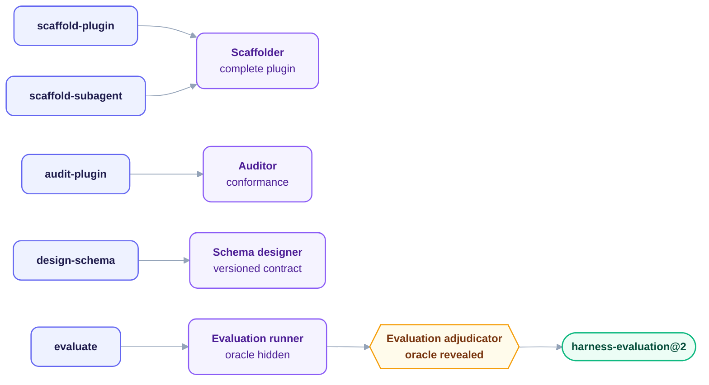

# mason — Plugin Authoring

**Stage:** Meta · **Output:** plugin artifacts and evaluations · **Version:** 3.2.0

Mason scaffolds plugins, audits conformance, designs inter-agent schemas, and evaluates workflow behavior with fixed hidden-oracle fixtures.

---

## When to Use

- You want to build a new plugin and need the correct directory structure
- You've written a plugin and want to verify it conforms to ecosystem rules
- You need to design a new JSON schema for a new inter-agent artifact type
- You want to generate a single conformant subagent `.md` file for an existing plugin
- You want a repeatable release or regression evaluation with exact plugin provenance

**Invoke with:** `"Create a plugin called X that does Y"`, `"Audit the X plugin for conformance"`, `"Design a schema for an artifact that carries Z"`, `"Write a subagent for task T"`, or `"Evaluate this workflow against fixture F"`.

---

## Install

**Claude Code** — add the marketplace once, then install by ID:
```
/plugin marketplace add orin-dx/agent-plugins
/plugin install mason
```

**AGY** — installs the full repo; see the [root README](../../README.md#install) for instructions.

**Codex** — see the [root Codex setup](../../README.md#codex), then run `codex plugin add mason@wisp-plugins`.

---

## Skills

| Skill | What it does | Subagent |
| :--- | :--- | :--- |
| `mason/scaffold-plugin` | Generates a complete, ready-to-install plugin directory given a plugin ID and description | `scaffolder` |
| `mason/audit-plugin` | Audits an existing plugin directory against all ecosystem conformance rules; returns structured pass/fail/warn per check | `auditor` |
| `mason/design-schema` | Designs a new JSON Schema (draft 2020-12) for an inter-agent artifact; checks for conflicts with existing schemas | `schema-designer` |
| `mason/scaffold-subagent` | Generates a single conformant subagent `.md` file for an existing plugin — skips plugin.json/SKILL.md/symlink | `scaffolder` (single-subagent mode) |
| `mason/evaluate` | Runs an isolated behavioral fixture and records a provenance-complete `harness-evaluation@2` | `evaluation-runner`, `evaluation-adjudicator` |

`audit-plugin` is not bare `audit` — that word is already `ranger`'s plugin-level skill name (code/bug auditing). See `shared/constitution.md`'s Skill Names rule.

---

## Subagents

| Subagent | Role | Tier | Description |
| :--- | :--- | :--- | :--- |
| `scaffolder` | Scaffolder | sonnet / medium | Generates a complete plugin directory: `plugin.json`, `SKILL.md`, stub subagents, `shared` symlink. |
| `auditor` | Conformance Auditor | sonnet / medium | Audits a plugin directory for ecosystem conformance across all required fields, structure rules, and authoring principles. |
| `schema-designer` | Schema Designer | sonnet / medium | Designs a new JSON Schema for a proposed inter-agent artifact; checks for conflicts with existing schemas. |
| `evaluation-runner` | Evaluation Runner | haiku / low | Runs public fixture input in isolation without seeing the oracle. |
| `evaluation-adjudicator` | Evaluation Adjudicator | opus / high | Validates artifacts and seeded detections after the oracle is revealed. |

---

## Dispatch

Mason exposes independent authoring, audit, schema, and evaluation routes. The routes with multi-stage or agent-backed flow are:



The paths are independent. `scaffold-plugin` and `scaffold-subagent` share the scaffolder in different modes.

---

## Output Schemas

- `evaluation-run@1` — immutable runner evidence captured before the hidden oracle is revealed; see `shared/schemas/evaluation-run@1.json`
- `harness-evaluation@2` — adjudicated detections, false passes, corrections, provenance, and comparison data; see `shared/schemas/harness-evaluation@2.json`

Scaffold and audit routes produce or inspect repository files rather than an inter-agent JSON artifact. `design-schema` produces the requested new versioned schema.

---

## Conformance Checks (auditor)

The auditor checks all of the following. A plugin that fails any check is not ecosystem-conformant:

| Check | Rule |
| :--- | :--- |
| Manifest fields | `plugin.json` has all required fields: `id`, `name`, `version`, `description`, `author`, `skills`, `agents` — checked by running `scripts/check-versions.sh` and reading this plugin's own result, not re-derived |
| Skill file | `skills/<id>/SKILL.md` exists with valid YAML frontmatter and a `description` trigger string |
| Agent files | All agents listed in `plugin.json` have a corresponding `.md` file |
| Agent descriptions | Shortest complete routing text; state trigger, input, output, and key constraints |
| 5-part body structure | Agent body has: constitution (byte-identical to the rest of the ecosystem), backstory, goal, judgment, output, in that order, with an optional `<load_first>` immediately after constitution — no success_criteria, no role sections, EARS only in constitution/output |
| `<load_first>` correctness | Present whenever an agent's goal implies a lookup it can't do from memory; its named reference file actually resolves |
| Orchestration completeness | Every status an agent's own output can emit has a routing entry in its plugin's SKILL.md, or is documented as terminal |
| Instruction economy | Direct, atomic rules; numbered procedures only when order affects correctness; length thresholds trigger review, not automatic failure |
| Verification evidence | Claimed boundaries, sibling searches, generated inputs, external state, completion, and longitudinal comparisons carry the evidence required by the constitution; unrelated methods are not forced |
| Cross-harness source | Native identity and skill routes match shared source; exact runtime dependencies are packaged; generated Codex output matches authored files |
| Model/effort tiering | Mechanical → haiku/low; Analysis → sonnet/medium; Judgment → opus/high; whole-system architectural synthesis (bounded to single-invocation-per-artifact tasks, not gates) → claude-fable-5-1/high |
| `shared` symlink | Points to `../../shared` — never copied or embedded |
| No authoring-time refs | Neither agent bodies nor `SKILL.md` reference `shared/agent-best-practices.md` at runtime — except `mason`'s own scaffolding skills, whose job is authoring agents per that guide |
| Reference file size | Every `shared/references/*.md` file stays at or under 120 lines — checked via `scripts/check-reference-size.sh`, not re-derived |

---

## Directory Layout

Plugins produced by `scaffolder` follow this exact layout — one skill directory named after the plugin id, the default for a new plugin:

```
plugins/<id>/
├── plugin.json                  # id, name, version, description, author, skills, agents
├── shared -> ../../shared       # symlink — never copy
├── skills/
│   └── <id>/
│       └── SKILL.md             # YAML frontmatter + body
└── agents/
    └── <agent-name>.md          # one file per agent in plugin.json
```

If a plugin's scope later grows to cover several genuinely independent, heterogeneous intents on the same artifact — not a linear pipeline invoked as one flow — `skills/<id>/` may split into multiple directories, one per skill (`skills/<skill-name>/SKILL.md`), each still following the frontmatter and 5-part-body rules. `courier`, `scribe`, `weaver`, and `mason` itself are all examples.

`mason/audit-plugin` checks every `SKILL.md` found under `skills/`, not just one — it doesn't assume the single-directory default.

---

## Key Authoring Principles

mason enforces these conventions when scaffolding and auditing:

- **Pull over inject** — agents receive a workspace path and a goal; they discover what they need via tools
- **Goal over procedure** — use decision criteria for judgment; number only order-dependent operations
- **Minimum viable prompt** — include the mission, evidence, output contract, and necessary constraints; omit padding
- **Instruction economy** — one direct rule per paragraph or list item; preserve decision-relevant context and remove the rest
- **Declared context** — runtime references and schemas are explicit, focused, and packaged for each harness

---

## References

- `shared/agent-best-practices.md` — full authoring checklist (mason authors use this; subagent bodies do not reference it at runtime)
- `shared/harness-authoring.md` — cross-harness identity, contract, workflow, and packaging boundaries
- `shared/references/behavioral-evaluation.md` — hidden-oracle evaluation and provenance rules
- `shared/schemas/` — existing schemas to check against when designing a new one
