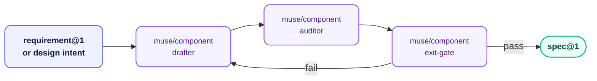

# muse — Component Specification

**Stage:** Design · **Output:** `spec@1` · **Version:** 1.0.0

Turns UI or design intent into a component spec a developer can implement — including its accessibility behavior — without a single clarifying question. Muse audits the spec, not the implementation.

- **Drafts** a component spec from a requirement or free-text design intent: props, variants, every interactive state, and accessibility criteria as testable propositions
- **Audits** the draft for missing states, missing accessibility criteria, and unmarked invalid prop combinations
- **Gates** the spec with a binding, default-fail exit gate before it proceeds to planning

One skill, one draft-audit-gate pipeline — reused unchanged regardless of which component is being specified.

---

## When to Use

- You have a `requirement@1` (or a design description/mockup) and need a formal component spec
- You want to check a drafted component spec for missing interactive states or ARIA criteria before it's implemented
- You need a binding pass/fail gate on a component spec before it enters planning

**Invoke with:** `"Spec this component"`, `"Draft a component spec for this design"`, `"Audit this component spec"`, `"Is this component spec ready?"`, `"Gate this component spec"`

Muse specs the component, not the code that implements it — for code-level accessibility hazard scanning after the component is built, see **[ranger](../ranger/)**'s accessibility hazard taxonomy.

---

## Install

**Claude Code** — add the marketplace once, then install by ID:
```
/plugin marketplace add orin-dx/agent-plugins
/plugin install muse
```

**AGY** — installs the full repo; see the [root README](../../README.md#install) for instructions.

**Codex** — see the [root Codex setup](../../README.md#codex), then run `codex plugin add muse@wisp-plugins`.

---

## Skills

| Skill | What it does | Subagent |
| :--- | :--- | :--- |
| `muse/component` | Drafts, audits, and gates a component `spec@1` — props, variants, per-state behavior, and accessibility criteria as testable propositions | `drafter`, `auditor`, `exit-gate` |

`component` is one skill, not three — the request itself determines which stage runs; there is no separate `muse/draft` or `muse/audit` to invoke.

---

## Subagents

| Subagent | Role | Tier | Description |
| :--- | :--- | :--- | :--- |
| `drafter` | Component Specification Drafter | sonnet / medium | Produces a `spec@1` from a `requirement@1` or design intent: props, variants, per-state observable behavior, and accessibility criteria. No TBDs permitted. Also runs in correction mode. |
| `auditor` | Component Specification Auditor | sonnet / medium | Adversarially reviews the draft for missing interactive states, missing accessibility criteria, and invalid prop combinations not marked as error cases. |
| `exit-gate` | Component Specification Exit Gate | opus / high | Binding pass/fail verdict before the spec enters planning. Default disposition: fail. Maximum 3 retries before escalation to a human. |

---

## Pipeline



Drafter/auditor review loops are capped at 2 iterations before reaching the exit gate. On fail, specific blockers are returned to `drafter` for a targeted retry. Maximum 3 retries before escalation to a human.

---

## Output Schemas

**`spec@1`** — see `shared/schemas/spec@1.json` (same schema `scribe` produces; muse introduces no new shape)

| Field | Required | Description |
| :--- | :--- | :--- |
| `id` | yes | Unique spec identifier |
| `purpose` | yes | One-sentence statement of what this component accomplishes |
| `scope` | yes | What is in scope for this spec |
| `non_goals` | yes | Explicit list of what this spec does NOT cover — including any state deliberately left unspecified |
| `api_surface` | no | The component's props — one entry per prop, `signature` carrying its type/domain |
| `acceptance_criteria` | yes | Array of testable propositions covering every prop, variant, state, and accessibility criterion; each has `is_error_case` flag |
| `spec_file_path` | no | Workspace-relative path where this spec is written on disk. Set after `exit-gate` passes. |
| `revision_note` | no | Set only on a correction — what changed and why, citing the affected criterion_id |
| `reasoning` | yes | Scratchpad — never forwarded downstream |

**`verdict@1`** — produced by `exit-gate` only; see `shared/schemas/verdict@1.json`

---

## Next Stage

Feed the gated `spec@1` to **[navigator](../navigator/)** for implementation planning.
