# ranger — Adversarial Bug Hunting

**Stage:** Cross-cutting · **Output:** `finding-report@2` · **Version:** 3.2.2

Adversarial bug hunting on live Rust, TypeScript, JavaScript, Python, and Go code.

- Builds a reachability manifest first, so dead code is never scanned.
- Sweeps live files against language-specific hazard taxonomies, optionally tracing data flow for intent-capture and error-downgrade candidates.
- Refutes every candidate before confirming it — a finding survives only when no refutation can be constructed and a concrete failing scenario can be stated.
- Groups related findings by shared root cause and routes structural families to `scribe:architect`.
- Produces `finding-report@2`, then uses the exit verifier after remediation.

---

## When to Use

- You want a thorough bug hunt across the codebase before a release
- You suspect a specific hazard category (e.g. unsafe memory, unhandled promises) and want a targeted scan
- You have a candidate bug report and want adversarial verification before acting on it
- You want to confirm all findings are resolved after remediation

**Invoke with:** `"Hunt for bugs"`, `"Security audit"`, `"Find vulnerabilities"`, `"Scan for unhandled promises"`, `"Audit this for memory safety issues"`, `"Verify this bug report"`, `"Check what's still broken after my fixes"`

---

## Install

**Claude Code** — add the marketplace once, then install by ID:
```
/plugin marketplace add orin-dx/agent-plugins
/plugin install ranger
```

**AGY** — installs the full repo; see the [root README](../../README.md#install) for instructions.

**Codex** — see the [root Codex setup](../../README.md#codex), then run `codex plugin add ranger@wisp-plugins`.

---

## How It Works

ranger is one skill, not a menu of sub-commands. The pipeline below is fixed — what changes is which part of the request drives it:

- **Full bug hunt** — no category or candidate named: every hazard taxonomy gets scanned.
- **Targeted scan** — the request names one hazard category (e.g. "unsafe memory", "unhandled promises"): the same pipeline runs, scoped to that category.
- **Verify one candidate** — the request hands ranger an already-identified bug: adversary runs directly against it, skipping the sweep.
- **Post-remediation check** — the request asks whether prior findings are resolved: exit-gate re-reads the code from scratch and confirms.

Unlike `courier` or `scribe`, ranger has exactly one skill directory (`skills/audit/`) — there's no `ranger/scan` or `ranger/verify` to invoke separately.

---

## Subagents

| Subagent | Role | Tier | Description |
| :--- | :--- | :--- | :--- |
| `recon` | Workspace Recon | haiku / low | Traces imports from entry points to build a verified live/dead file manifest. All downstream agents operate only on live files. |
| `scanner` | Hazard Scanner | sonnet / medium | Loads language-specific hazard taxonomies, searches candidate signals across live files, and emits every match as a candidate@1 entry. It does not adjudicate candidates. |
| `boundary-tracer` | Data Flow Tracer | sonnet / medium | Conditional. Invoked for T7 and T10 candidates only. Traces each field of the flagged struct or type from construction site to execution boundary and produces a field survival map for the adversary. |
| `adversary` | Adversarial Verifier | opus / high | Invoked once per candidate. Tries hard to refute before confirming. Runs a one-time constitution sweep for Invisible Invariants. Confirms only when a concrete failing scenario can be stated. |
| `exit-gate` | Exit Verifier | opus / high | Re-reads current code, checks syntactic and semantic siblings, verifies structural assessment, compilation, and tests. |

---

## Pipeline

```mermaid
%%{init: {'theme': 'base', 'flowchart': {'curve': 'basis', 'nodeSpacing': 40, 'rankSpacing': 56}, 'themeVariables': {'fontFamily': 'Inter, ui-sans-serif, system-ui, sans-serif', 'fontSize': '14px', 'lineColor': '#94a3b8', 'edgeLabelBackground': '#ffffff'}}}%%
flowchart LR
    classDef source fill:#eef2ff,stroke:#6366f1,stroke-width:1.5px,color:#1e1b4b,rx:10px,ry:10px,font-weight:600;
    classDef store fill:#f8fafc,stroke:#64748b,stroke-width:1.5px,color:#0f172a,rx:10px,ry:10px;
    classDef engine fill:#f5f3ff,stroke:#8b5cf6,stroke-width:1.5px,color:#4c1d95,rx:10px,ry:10px;
    classDef router fill:#fffbeb,stroke:#f59e0b,stroke-width:1.5px,color:#78350f,rx:10px,ry:10px,font-weight:600;
    classDef output fill:#ecfdf5,stroke:#10b981,stroke-width:1.5px,color:#064e3b,rx:10px,ry:10px,font-weight:600;

    ws["Workspace"] --> recon["<b>Recon</b><br/>inventory + capabilities"]
    recon --> scanner["<b>Scanner</b><br/>hazard candidates"]
    scanner -->|"T7 / T10"| bt["<b>Boundary tracer</b><br/>field survival"]
    scanner --> adv{{"<b>Adversary</b><br/>reachable failure"}}
    bt --> adv
    adv --> out(["finding-report@2"])
    out -.->|"structural family"| arch["scribe:architect"]
    out --> fix["Remediate confirmed findings"]
    fix --> gate{{"<b>Exit gate</b><br/>independent sibling search"}}
    gate --> verdict(["verdict@3"])

    class ws source
    class recon store
    class scanner engine
    class bt engine
    class adv router
    class arch router
    class fix engine
    class gate router
    class out output
    class verdict output
```



`boundary-tracer` is conditional — invoked only when the scanner produces T7 (write-only fields / intent-capture discard) or T10 (error downgrade) candidates.

Related confirmed findings form a possible defect family. When they share a root cause or reveal a missing domain concept or architectural constraint, pass `finding-report@2` to `scribe:architect` before remediation.

---

## Output Schemas

`finding-report@2` — see `shared/schemas/finding-report@2.json`

The pipeline also uses `workspace-manifest@1` for reachable files, `candidate-assessment@1` for per-candidate judgments, and `verdict@3` after remediation. See their matching files in `shared/schemas/`.

Each finding requires:

| Field | Description |
| :--- | :--- |
| `id` | Unique finding identifier |
| `description` | What the bug is |
| `file` | File path |
| `line` | Line number |
| `severity` | `critical`, `high`, `medium`, or `low` |
| `trigger_condition` | The exact condition under which the bug fires — for `plausible` findings, the suspected condition, since reachability can't be confirmed from the code alone |
| `root_cause` | Why it exists |
| `verdict` | `confirmed` — adversary could not refute it and stated a concrete failing scenario. `plausible` — adversary could not refute it either, but reachability depends on state outside the code (config, an external caller, environment); carried into `exit-gate`'s verdict as `flagged_for_review` rather than treated as a remediation target. |

---

## Dead Code Exclusion

`recon` traces imports from all declared entry points to build a verified live file set. Any file not reachable from any entry point is classified as dead and excluded from all scanning and adversarial phases. This eliminates false positives from unused code paths — ranger only reports bugs that can actually be triggered.

---

## Language Detection

Recon inspects the workspace root automatically:

| File found | Language | Hazard reference loaded |
| :--- | :--- | :--- |
| `Cargo.toml` | Rust | `shared/references/hazards/rust.md` and/or `shared/references/hazards/rust-boundaries.md`, per agent scope |
| `package.json` | TypeScript / JavaScript | `shared/references/hazards/typescript.md` and/or `shared/references/hazards/typescript-boundaries.md`, per agent scope |
| `pyproject.toml`, `requirements.txt`, Python files | Python | `shared/references/hazards/python.md` and/or `shared/references/hazards/python-boundaries.md` |
| `go.mod`, Go files | Go | `shared/references/hazards/go.md` and/or `shared/references/hazards/go-boundaries.md` |

---

## References

| File | Contents | Loaded by |
| :--- | :--- | :--- |
| `shared/references/hazards/rust.md` | Rust T1-T6, T8, and T9 candidate, confirmation, and refutation evidence | scanner (always), adversary (non-T7/T10 candidates) |
| `shared/references/hazards/rust-boundaries.md` | Rust taxonomies T7 and T10 — boundary-tracer's entire scope | boundary-tracer (always), scanner (full scans), adversary (T7/T10 candidates) |
| `shared/references/hazards/typescript.md` | TypeScript/JavaScript T1-T6, T8, and T9 candidate, confirmation, and refutation evidence | scanner (always), adversary (non-T7/T10 candidates) |
| `shared/references/hazards/typescript-boundaries.md` | TypeScript taxonomies T7 and T10 — boundary-tracer's entire scope | boundary-tracer (always), scanner (full scans), adversary (T7/T10 candidates) |
| `shared/references/hazards/python.md` | Python taxonomies outside T7/T10 | scanner, adversary |
| `shared/references/hazards/python-boundaries.md` | Python T7/T10 boundary hazards | scanner, boundary-tracer, adversary |
| `shared/references/hazards/go.md` | Go taxonomies outside T7/T10 | scanner, adversary |
| `shared/references/hazards/go-boundaries.md` | Go T7/T10 boundary hazards | scanner, boundary-tracer, adversary |
| `shared/schemas/candidate@1.json` | Scanner output shape | — |
| `shared/schemas/workspace-manifest@1.json` | Reachability and workspace provenance | recon → scanner and gates |
| `shared/schemas/finding-report@2.json` | Findings plus defect-family evidence | — |
| `shared/schemas/candidate-assessment@1.json` | Per-candidate confirmed, plausible, or dismissed judgment | adversary → caller |
| `shared/schemas/verdict@3.json` | Scoped exit verdict with gaps and pending checks | — |

---

## Integration

`finding-report@2` feeds structural defect families into **[scribe](../scribe/)**. After remediation, Ranger's exit gate returns `verdict@3`.
