# sentinel — Verification Gate

**Stage:** Gate · **Output:** `verdict@3` · **Version:** 2.1.1

One skill, one artifact-agnostic pipeline. Sentinel returns a scoped `verdict@3`: pass or fail, with blockers, coverage gaps, and pending checks. Unverifiable required criteria fail unless explicitly waived.

Sentinel is standalone. Its `plugin.json` declares `consumes: []`, and nothing invokes it automatically. Scribe and Smith have dedicated exit gates for their own artifacts; neither calls Sentinel's agents. Install Sentinel for an on-demand independent gate against any artifact.

---

## When to Use

- You want to verify a spec, plan, or changeset against a defined set of criteria
- You want an independent second opinion on whether an implementation meets its spec
- You need a formal pass/fail verdict with specific blockers before shipping
- You want to check a finding report for completeness before handing it off

**Invoke with:** `"Gate this spec"`, `"Verify this implementation against the spec"`, `"Run the verification gate"`, `"Check whether this changeset meets all acceptance criteria"`, `"Is this finding report complete?"`

---

## Install

**Claude Code** — add the marketplace once, then install by ID:
```
/plugin marketplace add orin-dx/agent-plugins
/plugin install sentinel
```

**AGY** — installs the full repo; see the [root README](../../README.md#install) for instructions.

**Codex** — see the [root Codex setup](../../README.md#codex), then run `codex plugin add sentinel@wisp-plugins`.

---

## Subagents

| Subagent | Role | Tier | Description |
| :--- | :--- | :--- | :--- |
| `recon` | Artifact Recon | haiku / low | Builds the verification manifest: artifact type, path, criteria to check, source files to read. No judgment. |
| `verifier` | Verifier | sonnet / medium | Reads each source file and classifies every criterion as `verified`, `failed`, or `unverifiable`. Neutral — reports evidence only, not verdicts. |
| `exit-gate` | Exit Gate | opus / high | Produces `verdict@3`. Default: fail. Unverifiable required criteria are failures unless explicitly waived. |

---

## How It Works

Sentinel is a single skill (`sentinel:sentinel` — the frontmatter `name: gate` is a cosmetic label, not the routing key; skills route by directory name) — not a set of per-artifact-type sub-skills. The same three-agent chain runs unchanged no matter what you hand it; `recon` is what determines the artifact type and derives its criteria, so nothing about the pipeline itself needs to vary by type.

```mermaid
%%{init: {'theme': 'base', 'flowchart': {'curve': 'basis', 'nodeSpacing': 40, 'rankSpacing': 56}, 'themeVariables': {'fontFamily': 'Inter, ui-sans-serif, system-ui, sans-serif', 'fontSize': '14px', 'lineColor': '#94a3b8', 'edgeLabelBackground': '#ffffff'}}}%%
flowchart LR
    classDef source fill:#eef2ff,stroke:#6366f1,stroke-width:1.5px,color:#1e1b4b,rx:10px,ry:10px,font-weight:600;
    classDef store fill:#f8fafc,stroke:#64748b,stroke-width:1.5px,color:#0f172a,rx:10px,ry:10px;
    classDef engine fill:#f5f3ff,stroke:#8b5cf6,stroke-width:1.5px,color:#4c1d95,rx:10px,ry:10px;
    classDef router fill:#fffbeb,stroke:#f59e0b,stroke-width:1.5px,color:#78350f,rx:10px,ry:10px,font-weight:600;
    classDef output fill:#ecfdf5,stroke:#10b981,stroke-width:1.5px,color:#064e3b,rx:10px,ry:10px,font-weight:600;
    classDef alert fill:#fff1f2,stroke:#f43f5e,stroke-width:1.5px,color:#881337,rx:10px,ry:10px,font-weight:600;

    Art["<b>Artifact</b><br/>criteria + current state"] --> Recon["<b>Recon</b><br/>haiku · low"]
    Recon --> Ver["<b>Verifier</b><br/>sonnet · medium"]
    Ver --> Gate{{"<b>Exit gate</b><br/>opus · high"}}
    Gate -->|"pass"| Done(["verdict@3 · pass"])
    Gate -.->|"blockers"| Fix["Producing agent<br/>targeted patch"]
    Fix -.->|"retry ≤ 3"| Art
    Fix -.->|"retry > 3"| Esc(["human escalation"])

    class Art source
    class Recon store
    class Ver engine
    class Gate router
    class Done output
    class Fix engine
    class Esc alert
```



Recon and verifier are deliberately separate: recon makes no judgments, verifier reports evidence without a verdict. Only `exit-gate` decides pass/fail — at the highest effort tier, to match the stakes.

---

## Output Schema

`verdict@3` — see `shared/schemas/verdict@3.json`

| Field | Description |
| :--- | :--- |
| `verdict` | `pass` or `fail` |
| `confidence` | Gate's confidence in the verdict |
| `blockers` | Array of specific, actionable failures — each maps to a criterion |
| `verdict_summary` | Human-readable summary (≤300 chars) |
| `artifact_type` | What was gated (spec, plan, changeset, finding-report, ...) |
| `retry_count` | Number of times this artifact has been through the gate |

---

## Retry Protocol

On `fail`, the orchestrator returns the `blockers` array directly to the producing agent for a **targeted patch** — not a full regeneration. On retry 2, escalate to a higher-effort model. After 3 retries, escalate to the human.

`retry_count` is tracked in `verdict@3` and incremented by the exit gate on each attempt.

---

## Used By

Nothing invokes Sentinel automatically. **[scribe](../scribe/)** and **[smith](../smith/)** run dedicated exit gates for `spec@1` and implementations. Use Sentinel as an independent check; wiring its verdict into shipping remains the caller's choice.
