# sentinel — Verification Gate

**Stage:** Gate · **Output:** `verdict@1` · **Version:** 2.0.0

One skill, one three-agent pipeline, artifact-agnostic. Point sentinel at a requirement, spec, plan, implementation, PR, changeset, or finding-report and it returns a binding `verdict@1` — pass or fail, with specific, actionable blockers on fail. Default disposition is **fail**: unverifiable criteria count as failures unless explicitly waived.

Sentinel is standalone. Its `plugin.json` declares `consumes: []`, and nothing invokes it automatically. `scribe`'s and `smith`'s own exit-gate agents already implement the same recon → verify → judge discipline sentinel formalizes, tailored to `spec@1` and `changeset@2` respectively — neither calls into sentinel's agents. Install sentinel when you want that same protocol available on demand against *any* artifact, including as an independent second opinion on top of scribe's or smith's own gate.

---

## When to Use

- You want to verify a spec, plan, or changeset against a defined set of criteria
- You want an independent second opinion on whether an implementation meets its spec
- You need a formal pass/fail verdict with specific blockers before shipping
- You want to check a finding report for completeness before handing it off

**Invoke with:** `"Gate this spec"`, `"Verify this implementation against the spec"`, `"Run the verification gate"`, `"Check whether this changeset meets all acceptance criteria"`, `"Is this finding report complete?"`

---

## Install

**Claude Code** — add the marketplace once, then install by ID:
```
/plugin marketplace add orin-dx/agent-plugins
/plugin install sentinel
```

**AGY** — installs the full repo; see the [root README](../../README.md#quick-start) for instructions.

---

## Subagents

| Subagent | Role | Tier | Description |
| :--- | :--- | :--- | :--- |
| `recon` | Artifact Recon | haiku / low | Builds the verification manifest: artifact type, path, criteria to check, source files to read. No judgment. |
| `verifier` | Verifier | sonnet / medium | Reads each source file and classifies every criterion as `verified`, `failed`, or `unverifiable`. Neutral — reports evidence only, not verdicts. |
| `exit-gate` | Exit Gate | opus / high | Produces the final `verdict@1`. Default: fail. Unverifiable criteria are failures unless explicitly waived. |

---

## How It Works

Sentinel is a single skill (`sentinel:sentinel` — the frontmatter `name: gate` is a cosmetic label, not the routing key; skills route by directory name) — not a set of per-artifact-type sub-skills. The same three-agent chain runs unchanged no matter what you hand it; `recon` is what determines the artifact type and derives its criteria, so nothing about the pipeline itself needs to vary by type.

```mermaid
%%{init: {'flowchart': {'curve': 'basis', 'nodeSpacing': 36, 'rankSpacing': 56}}}%%
flowchart LR
    classDef source fill:#eef2ff,stroke:#6366f1,stroke-width:1.5px,color:#1e1b4b,rx:10,ry:10,font-size:14px,font-weight:600;
    classDef store fill:#f8fafc,stroke:#64748b,stroke-width:1.5px,color:#0f172a,rx:10,ry:10,font-size:13px,font-weight:500;
    classDef engine fill:#f5f3ff,stroke:#8b5cf6,stroke-width:1.5px,color:#4c1d95,rx:10,ry:10,font-size:13px,font-weight:500;
    classDef router fill:#fffbeb,stroke:#f59e0b,stroke-width:1.5px,color:#78350f,rx:10,ry:10,font-size:14px,font-weight:600;
    classDef output fill:#ecfdf5,stroke:#10b981,stroke-width:1.5px,color:#064e3b,rx:10,ry:10,font-size:14px,font-weight:600;

    Art[artifact + criteria] --> Recon["recon
    haiku / low"]
    Recon --> Ver["verifier
    sonnet / medium"]
    Ver --> Gate["exit-gate
    opus / high"]
    Gate --> Done(["verdict@1"])

    class Art source
    class Recon store
    class Ver engine
    class Gate router
    class Done output
```



Recon and verifier are deliberately separate: recon makes no judgments, verifier reports evidence without a verdict. Only `exit-gate` decides pass/fail — at the highest effort tier, to match the stakes.

---

## Output Schema

`verdict@1` — see `shared/schemas/verdict@1.json`

| Field | Description |
| :--- | :--- |
| `verdict` | `pass` or `fail` |
| `confidence` | Gate's confidence in the verdict |
| `blockers` | Array of specific, actionable failures — each maps to a criterion |
| `verdict_summary` | Human-readable summary (≤300 chars) |
| `artifact_type` | What was gated (spec, plan, changeset, finding-report, ...) |
| `retry_count` | Number of times this artifact has been through the gate |

---

## Retry Protocol

On `fail`, the orchestrator returns the `blockers` array directly to the producing agent for a **targeted patch** — not a full regeneration. On retry 2, escalate to a higher-effort model. After 3 retries, escalate to the human.

`retry_count` is tracked in `verdict@1` and incremented by the exit gate on each pass.

---

## Used By

Nothing invokes sentinel automatically. **[scribe](../scribe/)** and **[smith](../smith/)** each run their own dedicated exit-gate agent following the same protocol sentinel formalizes, not sentinel itself. Install sentinel to run that protocol standalone against any artifact — `spec@1` from scribe, `changeset@2` from smith — as an independent check alongside their own gates. **[courier](../courier/)** consumes `changeset@2` directly from smith; wiring sentinel's verdict into a shipping decision is a caller choice, not a declared dependency.
