# smith — Implementation

**Stage:** Code · **Output:** committed code, `verdict@1` · **Version:** 2.2.0

One skill, one pipeline. Give it a `plan@1` and it executes every task in order — design, implement, test comprehensively, commit — then gates the result with mutation testing and an adversarial exit check before handing off. Test quality is enforced by the mutation-testing gate, not by mandating tests be written before the code they cover — see [Implementation Cycle](#implementation-cycle-per-task). No plan yet? Give it a `spec@1` directly.

Smith never assembles a changeset itself. It hands `criteria_evidence` — exact test and implementation locations for every criterion it proved — to **[courier](../courier/)**, which produces `changeset@2` from it.

---

## When to Use

- You have a `plan@1` and want it executed task-by-task
- You have a `spec@1` but no plan, and want to implement directly
- You need proof — not just a claim — that every acceptance criterion was actually tested, with tests validated by mutation testing rather than a write-first ritual

**Invoke with:** `"Implement this"`, `"Execute the plan"`, `"Build this feature"`

> The skill also triggers on "generate tests for X," "explain what this code does," and "refactor this without changing behavior" — but no agent here implements those as distinct modes. They fall through to the same pipeline below, which only fits some of them. See [Capability Gaps](#capability-gaps).

---

## Install

**Claude Code** — add the marketplace once, then install by ID:
```
/plugin marketplace add orin-dx/agent-plugins
/plugin install smith
```

**AGY** — installs the full repo; see the [root README](../../README.md#quick-start) for instructions.

---

## Subagents

| Subagent | Role | Tier | What it does |
| :--- | :--- | :--- | :--- |
| `recon` | Workspace Recon | haiku / low | Detects language, test runner, build tool. Inventories plan files. Confirms the baseline passes before any code is written. Flags `spec_drift_warning` if the plan's `spec_hash` no longer matches the spec file on disk. |
| `implementer` | Implementation Executor | sonnet / medium | Executes one task: design, implement, test comprehensively, commit. Absorbs precision tests from `mutator` when supplied. Reports `spec_contradiction` instead of forcing an implementation that satisfies neither the criterion nor reality. Defaults any absent/wrong/stale boundary value to a sum type over a raw value-plus-boolean pair, reporting `needs_architecture` when a single task's scope can't get there. |
| `mutator` | Mutation Gate | sonnet / medium | Runs mutation testing on the task's changed files. Designs a precision test for every surviving mutant. |
| `reviewer` | Pre-Gate Review | sonnet / medium | Neutral check before the exit gate: scope adherence, non-negotiable violations, sibling gaps, test quality. |
| `exit-gate` | Adversarial Verifier | opus / high | Independent, from-scratch verification that every criterion is implemented, tested, and passing, with no regressions. Produces `verdict@1`. |

---

## Pipeline

```mermaid
%%{init: {'flowchart': {'curve': 'basis', 'nodeSpacing': 40, 'rankSpacing': 60}}}%%
flowchart LR
    classDef source fill:#eef2ff,stroke:#6366f1,stroke-width:1.5px,color:#1e1b4b,rx:10,ry:10,font-size:14px,font-weight:600;
    classDef store fill:#f8fafc,stroke:#64748b,stroke-width:1.5px,color:#0f172a,rx:10,ry:10,font-size:13px,font-weight:500;
    classDef engine fill:#f5f3ff,stroke:#8b5cf6,stroke-width:1.5px,color:#4c1d95,rx:10,ry:10,font-size:13px,font-weight:500;
    classDef router fill:#fffbeb,stroke:#f59e0b,stroke-width:1.5px,color:#78350f,rx:10,ry:10,font-size:14px,font-weight:600;
    classDef output fill:#ecfdf5,stroke:#10b981,stroke-width:1.5px,color:#064e3b,rx:10,ry:10,font-size:14px,font-weight:600;

    Plan["plan@1
    (or spec@1 direct)"] --> Recon["recon
    haiku / low"]

    subgraph loop [" per task, × N "]
        direction LR
        Impl["implementer
        sonnet / medium"] --> Mut["mutator
        sonnet / medium"]
        Mut -.->|precision tests| Impl
        Mut --> Rev["reviewer
        sonnet / medium"]
    end

    Recon --> Impl
    Rev --> Gate["exit-gate
    opus / high"]
    Gate --> Done(["verdict@1"])

    class Plan source
    class Recon store
    class Impl,Mut engine
    class Rev,Gate router
    class Done output

    style loop fill:#fafafa,stroke:#cbd5e1,stroke-width:1.5px,stroke-dasharray: 4 4,rx:10px,ry:10px
```



Each task runs in a fresh `implementer` context — no state bleeds between tasks. `mutator` can feed precision tests back into `implementer` before `reviewer` and the next task proceed. `exit-gate` runs once, after every task completes, and confirms mutation testing ran.

---

## Output Schema

`verdict@1` — see `shared/schemas/verdict@1.json`. Produced by `exit-gate`: pass or fail, with specific blockers on failure.

Each `implementer` task also returns `criteria_evidence` — one `{criterion_id, test_file, test_line, implementation_file, implementation_line}` entry per criterion the task proves. The caller accumulates these across the run and hands them to `changeset-analyzer` when shipping, which uses them to populate `changeset@2.criteria_evidence` — see `shared/schemas/changeset@2.json`.

---

## Implementation Cycle (per task)

No shortcuts, but no mandated write-order either — tests are validated by the mutation gate below, not by which came first:

1. Read the task's covers_criteria acceptance criteria from the spec before writing any code.
2. Design the approach — for anything beyond a trivial change, decide the shape of the solution before locking it in through a test. Forcing a failing test into existence before any design work tends to freeze the implementation onto whatever shape that first test happened to imply. The plan's own code is a concrete baseline, not a mandate — use a better-shaped approach if implementing reveals one, as long as it satisfies the same file targets, `covers_criteria`, and tests, and note the deviation in `concerns`. See [ADR-009](../../docs/adr/009-implementer-shape-latitude.md).
3. Write the implementation.
4. Write comprehensive tests proving every covers_criteria criterion. Tests may be written alongside or after the implementation — what matters is that they'd fail if the implementation were wrong, not the order they were written in.
5. Run the full suite — confirm every test passes, with no regressions.
6. Commit with the plan's conventional commit message.

This departs from strict TDD deliberately — see [ADR-008](../../docs/adr/008-drop-test-first-ordering.md). A controlled comparison found agent-written code produced no measurable quality advantage from write-test-first ordering, at 3–9x the token cost, and that forcing a failing test into existence before any design work suppressed the upfront design agents otherwise did well ([Böckeler, "TDD inside the agent loop"](https://martinfowler.com/articles/exploring-gen-ai/tdd-in-the-agent-loop.html)). The mutation gate below is what actually verifies test quality — mutation score, not write order, is the evidence.

---

## Mutation Gate (per task)

After a task commits, `mutator` runs mutation testing scoped to the changed files — `cargo-mutants` for Rust, Stryker for TypeScript/JavaScript, detected from the workspace root.

For every surviving mutant, it designs a precision test that would kill it and returns those to `implementer` to write and make pass. Only when zero mutants survive — or the tool is unavailable, recorded as a gap rather than a block — does the batch move to `reviewer`.

---

## Exit Gate

`exit-gate` runs once, after all tasks complete, with no inherited context from any prior agent. It reads the current code from scratch, assumes the implementation is incomplete, and confirms mutation testing ran before it returns `verdict@1`.

On fail, blockers go back to `implementer` for a targeted fix — three retries, then escalate to a human.

---

## Capability Gaps

Three of the skill's trigger phrases have no agent behind them:

| Trigger phrase | What actually happens |
| :--- | :--- |
| "generate tests for X" | Only produces a real result if reframed as implementation tasks whose deliverable *is* the test — there's no test-only mode. |
| "explain what this code does" | Unimplemented. There's no implementation to write for an explanation, so the pipeline doesn't fit — no agent here produces one. |
| "refactor this without changing behavior" | Unimplemented as a distinct mode. A refactor only runs through this pipeline if it's expressed as tasks with their own red/green cycle proving behavior is unchanged. |

If you need any of these as real capabilities, they'd need a dedicated agent — this is a documentation-accuracy note, not a promise they're coming.

---

## Next Stage

Feed `verdict@1` to **[sentinel](../sentinel/)** for standalone gate verification. Hand the accumulated `criteria_evidence` to **[courier](../courier/)** for commit, PR, changeset, and release tooling.
