# smith — Implementation

**Stage:** Code · **Output:** code, `implementation-review@2`, `verdict@3` · **Version:** 2.4.2

Smith executes each plan batch through implementation, mutation, defect-family review, and an independent exit gate. Review finds syntactic and semantic siblings, records their shared cause, and checks for missing domain concepts or architectural constraints. No plan yet? Give it a `spec@1` directly.

Smith never assembles a changeset itself. It hands `criteria_evidence` — exact test and implementation locations for every criterion it proved — to **[courier](../courier/)**, which produces `changeset@2` from it.

---

## When to Use

- You have a `plan@1` and want it executed task-by-task
- You have a `spec@1` but no plan, and want to implement directly
- You need proof — not just a claim — that every acceptance criterion was actually tested, with tests validated by mutation testing rather than a write-first ritual

**Invoke with:** `"Implement this"`, `"Execute the plan"`, `"Build this feature"`

> The skill also triggers on "generate tests for X," "explain what this code does," and "refactor this without changing behavior" — but no agent here implements those as distinct modes. They fall through to the same pipeline below, which only fits some of them. See [Capability Gaps](#capability-gaps).

---

## Install

**Claude Code** — add the marketplace once, then install by ID:
```
/plugin marketplace add orin-dx/agent-plugins
/plugin install smith
```

**AGY** — installs the full repo; see the [root README](../../README.md#install) for instructions.

**Codex** — see the [root Codex setup](../../README.md#codex), then run `codex plugin add smith@wisp-plugins`.

---

## Subagents

| Subagent | Role | Tier | What it does |
| :--- | :--- | :--- | :--- |
| `recon` | Workspace Recon | haiku / low | Detects language, test runner, build tool. Inventories plan files. Confirms the baseline passes before any code is written. Flags `spec_drift_warning` if the plan's `spec_hash` no longer matches the spec file on disk. |
| `implementer` | Implementation Executor | sonnet / medium | Designs, implements, and tests one task. Commits only with explicit authorization. Reports contradictions and architecture needs instead of forcing a pass. |
| `mutator` | Mutation Gate | sonnet / medium | Runs mutation testing on the task's changed files. Designs a precision test for every surviving mutant. |
| `reviewer` | Pre-Gate Review | sonnet / medium | Produces `implementation-review@2`: issues, sibling candidate sites, verification gaps, defect families, and structural assessments. |
| `exit-gate` | Adversarial Verifier | opus / high | Independently verifies current code, relevant boundaries, sibling candidates, and completed checks. Produces `verdict@3`. |

---

## Pipeline

```mermaid
%%{init: {'theme': 'base', 'flowchart': {'curve': 'basis', 'nodeSpacing': 40, 'rankSpacing': 56}, 'themeVariables': {'fontFamily': 'Inter, ui-sans-serif, system-ui, sans-serif', 'fontSize': '14px', 'lineColor': '#94a3b8', 'edgeLabelBackground': '#ffffff'}}}%%
flowchart LR
    classDef source fill:#eef2ff,stroke:#6366f1,stroke-width:1.5px,color:#1e1b4b,rx:10px,ry:10px,font-weight:600;
    classDef store fill:#f8fafc,stroke:#64748b,stroke-width:1.5px,color:#0f172a,rx:10px,ry:10px;
    classDef engine fill:#f5f3ff,stroke:#8b5cf6,stroke-width:1.5px,color:#4c1d95,rx:10px,ry:10px;
    classDef router fill:#fffbeb,stroke:#f59e0b,stroke-width:1.5px,color:#78350f,rx:10px,ry:10px,font-weight:600;
    classDef output fill:#ecfdf5,stroke:#10b981,stroke-width:1.5px,color:#064e3b,rx:10px,ry:10px,font-weight:600;

    Plan["<b>Implementation scope</b><br/><code>plan@1</code> or direct <code>spec@1</code>"] --> Recon["<b>Recon</b><br/>baseline + capabilities"]

    subgraph loop ["Per subsystem batch · × N"]
        direction LR
        Impl["<b>Implementer</b><br/>smallest safe change"] --> Mut["<b>Mutator</b><br/>discrimination evidence"]
        Mut -.->|"precision tests"| Impl
        Mut --> Rev{{"<b>Reviewer</b><br/>families + system fit"}}
    end

    Recon --> Impl
    Rev -.->|"changes requested"| Impl
    Rev -.->|"needs architecture"| Arch["scribe:architect"]
    Arch -.->|"gated plan amendment"| Plan
    Rev -->|"all batches approved"| Gate{{"<b>Exit gate</b><br/>complete changeset"}}
    Gate --> Done(["verdict@3"])

    class Plan source
    class Recon store
    class Impl,Mut engine
    class Rev,Arch,Gate router
    class Done output

    style loop fill:#fafafa,stroke:#cbd5e1,stroke-width:1.5px,stroke-dasharray: 4 4,rx:10px,ry:10px
```



Each batch runs in a fresh `implementer` context. Mutation survivors return as precision tests. Reviewer findings return for scoped repair or route to `scribe:architect`; only approved reviews reach exit-gate.

---

## Output Schemas

`verdict@3` — see `shared/schemas/verdict@3.json`. Produced by `exit-gate`: a scoped pass or fail with blockers, gaps, and pending checks.

`implementation-review@2` — see `shared/schemas/implementation-review@2.json`. Carries lineage, sibling candidates, boundary and input-space evidence, issues, gaps, and structural assessments.

`workspace-manifest@1` — see `shared/schemas/workspace-manifest@1.json`. Records detected languages, tools, capabilities, baseline state, and provenance.

`implementation-result@1` — see `shared/schemas/implementation-result@1.json`. Records one batch outcome, criterion evidence, commands, changed files, gaps, and any spec or architecture escalation.

`mutation-report@2` — see `shared/schemas/mutation-report@2.json`. Records the selected method, commands, cases, survivors, generated-input evidence, precision tests, gaps, and errors.

The reviewer loads `shared/references/verification/implementation-review.md`, which selects the language hazards, architecture smells, and comment standard relevant to the diff.

Each `implementer` batch also returns `criteria_evidence` — one `{criterion_id, test_file, test_line, implementation_file, implementation_line}` entry per criterion the batch proves. The caller accumulates these across the run and hands them to `changeset-analyzer` when shipping, which uses them to populate `changeset@2.criteria_evidence` — see `shared/schemas/changeset@2.json`.

---

## Implementation Cycle (per subsystem batch)

No shortcuts, but no mandated write-order either — tests are validated by the mutation gate below, not by which came first:

1. Read the task's covers_criteria acceptance criteria from the spec before writing any code.
2. Choose the implementation shape. Treat plan code as a baseline, not a transcript; record any better-shaped deviation in `concerns`.
3. Write the implementation.
4. Write tests that fail when each covered criterion is violated.
5. Run targeted tests, then the relevant full suite.
6. Record exact implementation and test evidence for each criterion.
7. Commit only with user authorization.

This departs from strict TDD deliberately — see [ADR-008](../../docs/adr/008-drop-test-first-ordering.md). A controlled comparison found agent-written code produced no measurable quality advantage from write-test-first ordering, at 3–9x the token cost, and that forcing a failing test into existence before any design work suppressed the upfront design agents otherwise did well ([Böckeler, "TDD inside the agent loop"](https://martinfowler.com/articles/exploring-gen-ai/tdd-in-the-agent-loop.html)). The mutation gate below is what actually verifies test quality — mutation score, not write order, is the evidence.

---

## Mutation Gate (per subsystem batch)

After implementation, `mutator` uses the project-native mutation tool when available. Otherwise it performs a safe deliberate-fault check or records the missing capability. Property, fuzz, race, integration, and boundary checks are selected when they fit the changed risk; generative checks must name their generator and oracle.

For every surviving mutant, it designs a precision test that would kill it and returns those to `implementer` to write and make pass. Only when zero mutants survive — or the tool is unavailable, recorded as a gap rather than a block — does the batch move to `reviewer`.

---

## Defect-Family Review

Reviewer searches for the same syntax or algorithm and for different code expressing the same domain responsibility or failure state. Related instances are grouped by root cause and assessed for missing concepts, states, operations, boundaries, abstractions, invariants, or enforcement.

- Scoped instances return to `implementer` for repair.
- Duplicated logic is unified when one implementation can own the behavior.
- Structural gaps route to `scribe:architect` before work resumes.
- Deferrals require an explicit reason for every affected instance.

---

## Exit Gate

`exit-gate` runs after all batches have approved reviews. It reads current code independently, validates `implementation-review@2`, derives its own sibling candidates, and verifies each structural disposition and relevant boundary before returning `verdict@3`.

On fail, blockers go back to `implementer` for a targeted fix — three retries, then escalate to a human.

---

## Capability Gaps

Three of the skill's trigger phrases have no agent behind them:

| Trigger phrase | What actually happens |
| :--- | :--- |
| "generate tests for X" | Only produces a real result if reframed as implementation tasks whose deliverable *is* the test — there's no test-only mode. |
| "explain what this code does" | Unimplemented. There's no implementation to write for an explanation, so the pipeline doesn't fit — no agent here produces one. |
| "refactor this without changing behavior" | Unimplemented as a distinct mode. A refactor only runs through this pipeline if it's expressed as tasks with their own red/green cycle proving behavior is unchanged. |

If you need any of these as real capabilities, they'd need a dedicated agent — this is a documentation-accuracy note, not a promise they're coming.

---

## Next Stage

Feed `verdict@3` to **[sentinel](../sentinel/)** for standalone gate verification. Hand the accumulated `criteria_evidence` to **[courier](../courier/)** for commit, PR, changeset, and release tooling.
