# trace — Research Synthesis

**Stage:** Research · **Output:** `research-report@1` · **Version:** 1.2.4

One skill, one pipeline: map sources, read only what the map points at, synthesize into a report that separates confirmed findings from assumptions, then adversarially assess risk on the resulting approach. Use trace before a spec gets written, not after — a spec built on unverified assumptions fails the moment implementation reveals reality.

---

## When to Use

- You have a requirement and want to understand the technical landscape before designing a solution
- You suspect there are existing patterns in the codebase worth reusing
- You want a risk assessment of a proposed approach before anyone writes code
- The domain is unfamiliar and you need a structured prior art survey

**Invoke with:** `"Research how X is typically implemented"`, `"Survey the codebase for existing patterns related to Y"`, `"What are the risks of approach Z"`, `"Run trace on this requirement"`

---

## Subagents

| Subagent | Role | Tier | Description |
| :--- | :--- | :--- | :--- |
| `recon` | Source Mapper | haiku / low | Maps available sources — internal specs/docs/code, dependency manifests, external search terms — without reading them. Narrows scope to `internal`, `external`, or `both` based on what the question actually needs. |
| `reader` | Source Reader | sonnet / medium | Reads each source recon mapped and extracts findings with confidence classification. Reads only what was mapped — no wandering. |
| `synthesizer` | Synthesizer | sonnet / medium | Aggregates findings into a coherent `research-report@1`. Resolves contradictions and notes open questions. |
| `risk-assessor` | Risk Assessor | sonnet / medium | Reviews the proposed approach for technical risks before the spec is written. Can run standalone against an already-decided approach, or against synthesizer's own output. Surfaces risks neutrally, no recommendation on whether to proceed. |

There is one skill here, not a menu of commands — trace is this pipeline, and the pipeline adapts to what's asked rather than exposing separate named modes for "full survey" versus "just the risk check."

---

## Pipeline

```mermaid
flowchart LR
    classDef source fill:#eef2ff,stroke:#6366f1,stroke-width:2px,color:#1e1b4b,rx:8px,ry:8px;
    classDef store fill:#f8fafc,stroke:#64748b,stroke-width:2px,color:#0f172a,rx:8px,ry:8px;
    classDef engine fill:#f5f3ff,stroke:#8b5cf6,stroke-width:2px,color:#4c1d95,rx:8px,ry:8px;
    classDef router fill:#fffbeb,stroke:#f59e0b,stroke-width:2px,color:#78350f,rx:8px,ry:8px;
    classDef output fill:#ecfdf5,stroke:#10b981,stroke-width:2px,color:#064e3b,rx:8px,ry:8px;

    Req["requirement@1
    or free-text question"] --> Recon["recon
    haiku / low"]
    Recon -->|source map| Reader["reader
    sonnet / medium"]
    Reader -->|findings + confidence| Synth["synthesizer
    sonnet / medium"]
    Synth -->|"research-report@1"| Risk["risk-assessor
    sonnet / medium"]
    Risk --> Out(["research-report@1
    + risks"])

    class Req source
    class Recon store
    class Reader engine
    class Synth engine
    class Risk router
    class Out output
```



Recon runs first and maps all sources before any reading begins. Reader and synthesizer are separate to keep source extraction honest — synthesizer cannot retroactively shape what was read. Risk assessor runs last with full context.

---

## Output Schema

`research-report@1` — see `shared/schemas/research-report@1.json`

Each finding is classified as one of:

| Confidence | Meaning |
| :--- | :--- |
| `confirmed` | Directly verified in source — code or authoritative doc read |
| `likely` | Strong inference from multiple sources, no direct verification |
| `assumed` | Reasonable assumption; no source found — flagged for follow-up |

The risk assessor appends a `risks` section: each risk has a description, severity, likelihood, trigger condition, and mitigation sketch.

---

## Install

**Claude Code** — add the marketplace once, then install by ID:
```
/plugin marketplace add orin-dx/agent-plugins
/plugin install trace
```

**AGY** — installs the full repo; see the [root README](../../README.md#quick-start) for instructions.

---

## Next Stage

Feed `research-report@1` alongside `requirement@1` to **[canon](../canon/)** (spec drafting).
