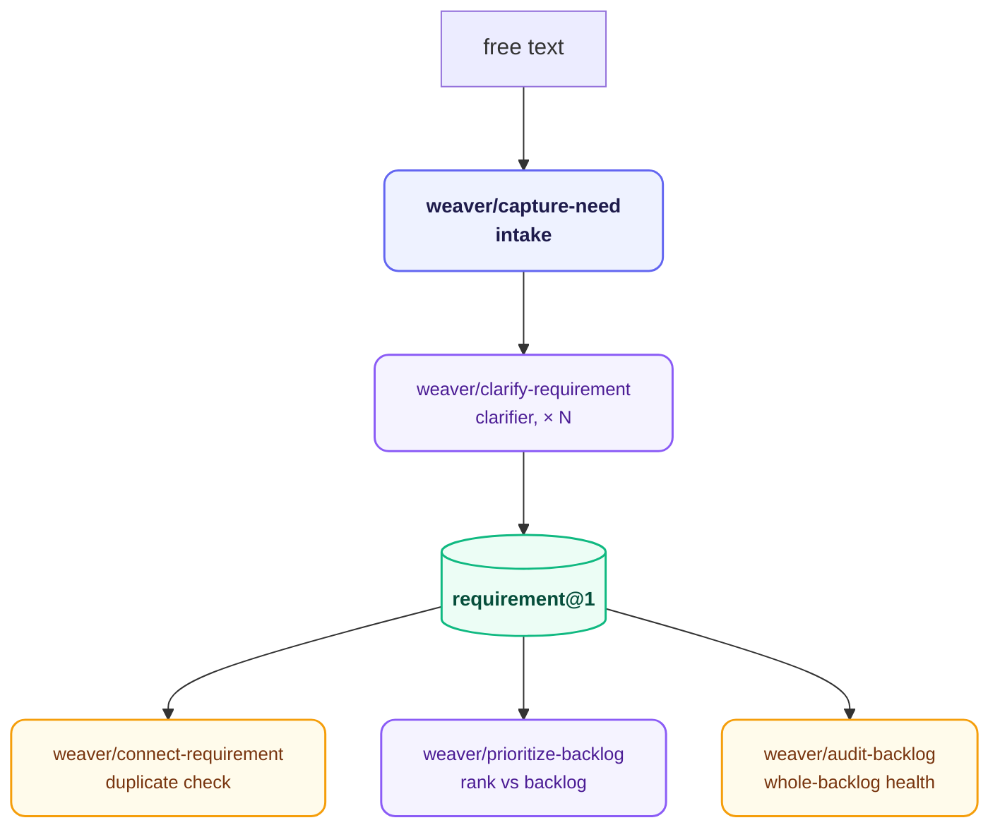

# weaver — Need Definition

**Stage:** Need · **Output:** `requirement@1` · **Version:** 3.0.0

Converts a raw need statement — a one-liner, a vague complaint, a stakeholder ask — into a structured `requirement@1` artifact that a spec writer can act on without asking a single follow-up question. Works with GitHub Issues by default; any issue tracker that emits `requirement@1` can substitute.

Five independently-triggered skills, not a linear pipeline — pick the one that matches the task. `capture-need` → `clarify-requirement` is the closest thing to a fixed sequence; `prioritize-backlog`, `connect-requirement`, and `audit-backlog` are invoked on demand.

---

## When to Use

- You have a fuzzy idea and want to structure it before anyone writes code
- You need to capture a stakeholder request as a formal, traceable requirement
- You want to know what to work on first out of several open requirements
- You want to check whether one requirement already exists or overlaps with something else
- You want to audit the whole backlog for gaps, duplicates, or requirements with no matching spec

**Invoke with:** `"We need X"`, `"Users are asking for Y"`, `"The problem is Z"`, `"Capture this requirement"`, `"What should we prioritize"`, `"Is this already captured?"`, `"Audit the backlog"`

---

## Install

**Claude Code** — add the marketplace once, then install by ID:
```
/plugin marketplace add orin-dx/agent-plugins
/plugin install weaver
```

**AGY** — installs the full repo; see the [root README](../../README.md#quick-start) for instructions.

---

## Skills

| Skill | What it does | Subagent |
| :--- | :--- | :--- |
| `weaver/capture-need` | Converts a free-text need into a `requirement@1` draft — no questions asked, all inferred fields noted | `intake` |
| `weaver/clarify-requirement` | Identifies the most critical gap in a draft and asks one focused question, or returns it complete with `out_of_scope` populated | `clarifier` |
| `weaver/prioritize-backlog` | Ranks a set of requirement drafts by impact, urgency, and dependency order, with a rationale per ranking | `prioritizer` |
| `weaver/connect-requirement` | Checks one requirement (or a small set) against the workspace for coverage, duplicates, and related artifacts | `auditor` (connect mode) |
| `weaver/audit-backlog` | Cross-references all open requirements against specs and implementation files — gaps, coverage, duplicates | `auditor` |

`audit-backlog` is not bare `audit` — that word is already `ranger`'s plugin-level skill name (code/bug auditing). See `shared/constitution.md`'s Skill Names rule.

---

## Subagents

| Subagent | Role | Tier | Description |
| :--- | :--- | :--- | :--- |
| `intake` | Intake Structurer | sonnet / medium | Converts free text into a `requirement@1` draft. Infers all fields it can; leaves gaps noted in `reasoning`. |
| `clarifier` | Clarifier | sonnet / medium | Identifies the most critical gap in the draft and asks one focused question, or returns the completed requirement if all dimensions are met. One question per invocation. |
| `prioritizer` | Backlog Prioritizer | sonnet / medium | Ranks requirement@1 drafts by impact, urgency, and dependency order — a dependency overrides an otherwise higher impact/urgency score. |
| `auditor` | Requirement Coverage Auditor | sonnet / medium | Cross-references requirement@1 objects against specs and implementation files for coverage and duplicates (`plan@1` isn't persisted to disk, so plan coverage isn't checkable). Runs at full-backlog scope (`audit-backlog`) or single-requirement scope (`connect-requirement`) — same agent, same output shape, different input size. |

---

## Pipeline



`weaver/clarify-requirement` loops until each `done_when` criterion is specific enough to write a failing test against it, the stakeholder is identified with enough context, and `out_of_scope` boundaries are explicit. `connect-requirement`, `prioritize-backlog`, and `audit-backlog` are on-demand checks, not required stops before `scribe/draft-spec`.

---

## Output Schema

`requirement@1` — see `shared/schemas/requirement@1.json`

| Field | Required | Description |
| :--- | :--- | :--- |
| `id` | yes | Unique requirement identifier |
| `statement` | yes | One sentence describing the need |
| `stakeholder` | yes | Who this serves, with enough context to understand their perspective |
| `why` | yes | Underlying pain or opportunity |
| `done_when` | yes | Array of testable propositions, each confirmable true/false from the outside |
| `out_of_scope` | yes | Explicit boundaries that prevent scope creep |
| `reasoning` | yes | Scratchpad — never forwarded downstream |

A requirement is complete when a downstream spec writer can read it and produce an accurate, unambiguous spec without asking clarifying questions.

---

## Extensibility

Any issue tracker (Jira, Linear, Notion) can substitute as the backing store as long as it emits `requirement@1`. The downstream pipeline is agnostic — it only consumes the schema.

---

## Next Stage

Feed `requirement@1` to **[vanguard](../vanguard/)** for research, or directly to **[scribe](../scribe/)** if no prior art survey is needed.
